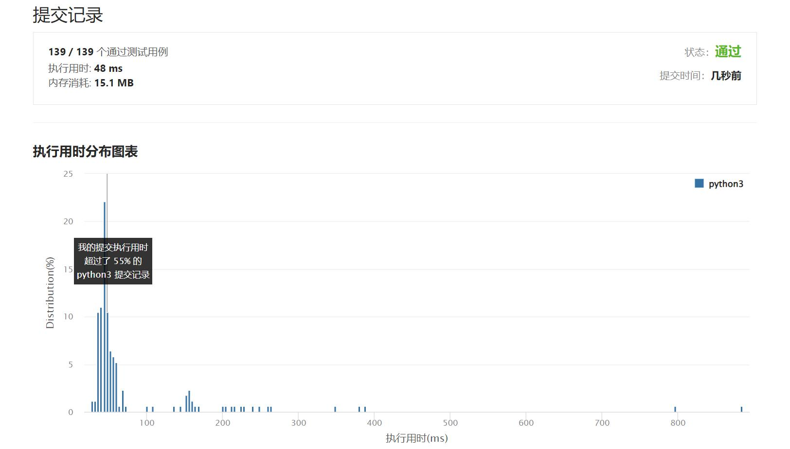

# 768-最多能完成排序的块II

Author：_Mumu

创建日期：2022/08/13

通过日期：2022/08/13

*****

踩过的坑：

1. 轻松愉快
1. 排序+哈希表存储两列表元素的差，如果没差表明分割好了一个块
1. 单调栈牛逼

已解决：430/2737

*****

难度：困难

问题描述：

这个问题和“最多能完成排序的块”相似，但给定数组中的元素可以重复，输入数组最大长度为2000，其中的元素最大为10**8。

arr是一个可能包含重复元素的整数数组，我们将这个数组分割成几个“块”，并将这些块分别进行排序。之后再连接起来，使得连接的结果和按升序排序后的原数组相同。

我们最多能将数组分成多少块？

示例 1:

输入: arr = [5,4,3,2,1]
输出: 1
解释:
将数组分成2块或者更多块，都无法得到所需的结果。
例如，分成 [5, 4], [3, 2, 1] 的结果是 [4, 5, 1, 2, 3]，这不是有序的数组。 
示例 2:

输入: arr = [2,1,3,4,4]
输出: 4
解释:
我们可以把它分成两块，例如 [2, 1], [3, 4, 4]。
然而，分成 [2, 1], [3], [4], [4] 可以得到最多的块数。 
注意:

arr的长度在[1, 2000]之间。
arr[i]的大小在[0, 10**8]之间。

来源：力扣（LeetCode）
链接：https://leetcode.cn/problems/max-chunks-to-make-sorted-ii