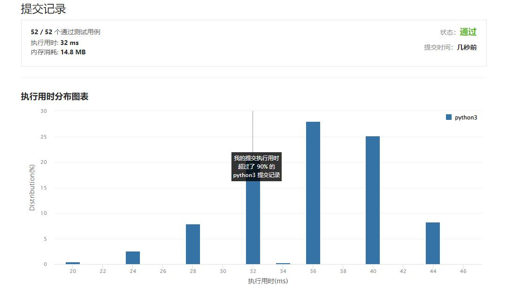

# 769-最多能完成排序的块

Author：_Mumu

创建日期：2022/10/13

通过日期：2022/10/13

*****

踩过的坑：

1. 轻松愉快

已解决：490/2813

*****

难度：中等

问题描述：

给定一个长度为 n 的整数数组 arr ，它表示在 [0, n - 1] 范围内的整数的排列。

我们将 arr 分割成若干 块 (即分区)，并对每个块单独排序。将它们连接起来后，使得连接的结果和按升序排序后的原数组相同。

返回数组能分成的最多块数量。

 

示例 1:

输入: arr = [4,3,2,1,0]
输出: 1
解释:
将数组分成2块或者更多块，都无法得到所需的结果。
例如，分成 [4, 3], [2, 1, 0] 的结果是 [3, 4, 0, 1, 2]，这不是有序的数组。
示例 2:

输入: arr = [1,0,2,3,4]
输出: 4
解释:
我们可以把它分成两块，例如 [1, 0], [2, 3, 4]。
然而，分成 [1, 0], [2], [3], [4] 可以得到最多的块数。

提示:

n == arr.length
1 <= n <= 10
0 <= arr[i] < n
arr 中每个元素都 不同

来源：力扣（LeetCode）
链接：https://leetcode.cn/problems/max-chunks-to-make-sorted