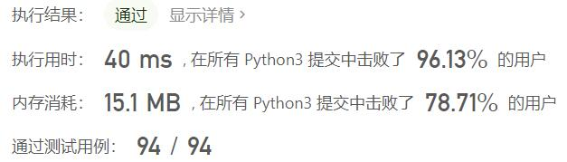

# 777-在LR字符串中交换相邻字符

Author：_Mumu

创建日期：2022/10/02

通过日期：2022/10/02

*****

踩过的坑：

1. 轻松愉快（指直接cv

已解决：479/2797

*****

难度：中等

问题描述：

在一个由 'L' , 'R' 和 'X' 三个字符组成的字符串（例如"RXXLRXRXL"）中进行移动操作。一次移动操作指用一个"LX"替换一个"XL"，或者用一个"XR"替换一个"RX"。现给定起始字符串start和结束字符串end，请编写代码，当且仅当存在一系列移动操作使得start可以转换成end时， 返回True。

 

示例 :

输入: start = "RXXLRXRXL", end = "XRLXXRRLX"
输出: True
解释:
我们可以通过以下几步将start转换成end:
RXXLRXRXL ->
XRXLRXRXL ->
XRLXRXRXL ->
XRLXXRRXL ->
XRLXXRRLX

提示：

1 <= len(start) = len(end) <= 10000。
start和end中的字符串仅限于'L', 'R'和'X'。

来源：力扣（LeetCode）
链接：https://leetcode.cn/problems/swap-adjacent-in-lr-string