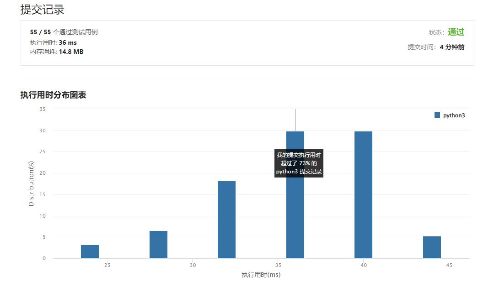

# 779-第K个语法符号

Author：_Mumu

创建日期：2022/10/20

通过日期：2022/10/20

*****

踩过的坑：

1. 轻松愉快
2. 由于这个结构和它的左子树以及左子树的左子树等都是完全一样的，所以答案只和`k`有关，和`n`无关
3. 由于`0`变为`01`，`1`变为`10`，左子节点都和父节点一样，右子节点都和父节点相反
4. 向上搜索，只要`k>1`，若`k`是偶数，则其父节点与它相反且位置是`k // 2`；若`k`是奇数，则其父节点与它相同且位置是`k // 2 + 1`
5. 令`ans = 0`，不断重复上一步直到`k == 1`，此时`ans`即为答案

已解决：497/2822

*****

难度：中等

问题描述：

我们构建了一个包含 n 行( 索引从 1  开始 )的表。首先在第一行我们写上一个 0。接下来的每一行，将前一行中的0替换为01，1替换为10。

例如，对于 n = 3 ，第 1 行是 0 ，第 2 行是 01 ，第3行是 0110 。
给定行数 n 和序数 k，返回第 n 行中第 k 个字符。（ k 从索引 1 开始）

示例 1:

输入: n = 1, k = 1
输出: 0
解释: 第一行：0
示例 2:

输入: n = 2, k = 1
输出: 0
解释: 
第一行: 0 
第二行: 01
示例 3:

输入: n = 2, k = 2
输出: 1
解释:
第一行: 0
第二行: 01

提示:

1 <= n <= 30
1 <= k <= 2n - 1

来源：力扣（LeetCode）
链接：https://leetcode.cn/problems/k-th-symbol-in-grammar