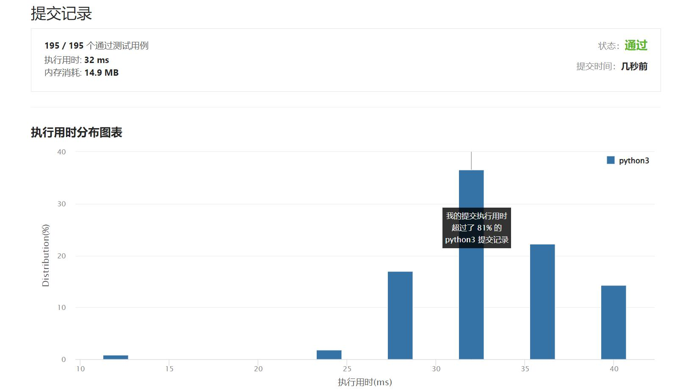

# 780-到达终点

Author：_Mumu

创建日期：2022/04/09

通过日期：2022/04/09

*****

踩过的坑：

1. ummm好家伙，好吧，还以为dfs了，结果。。真妙

已解决：304/2585

*****

难度：困难

问题描述：

给定四个整数 sx , sy ，tx 和 ty，如果通过一系列的转换可以从起点 (sx, sy) 到达终点 (tx, ty)，则返回 true，否则返回 false。

从点 (x, y) 可以转换到 (x, x+y)  或者 (x+y, y)。

 

示例 1:

输入: sx = 1, sy = 1, tx = 3, ty = 5
输出: true
解释:
可以通过以下一系列转换从起点转换到终点：
(1, 1) -> (1, 2)
(1, 2) -> (3, 2)
(3, 2) -> (3, 5)
示例 2:

输入: sx = 1, sy = 1, tx = 2, ty = 2 
输出: false
示例 3:

输入: sx = 1, sy = 1, tx = 1, ty = 1 
输出: true

提示:

1 <= sx, sy, tx, ty <= 109

来源：力扣（LeetCode）
链接：https://leetcode-cn.com/problems/reaching-points