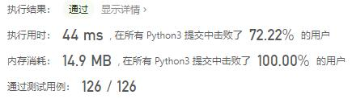
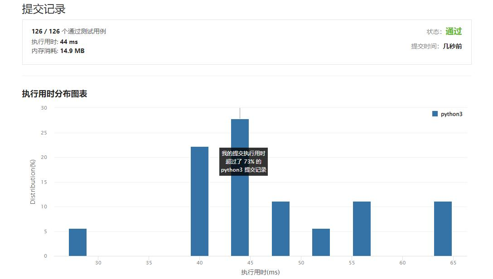

# 782-变为棋盘

Author：_Mumu

创建日期：2022/08/23

通过日期：2022/08/23

*****

踩过的坑：

1. 牛逼啊
2. 每一行要么和第一行完全相同，要么和第一行完全不同，这样矩阵行和列交换就转换成了第一行和第一列的内部交换了

已解决：440/2752

*****

难度：困难

问题描述：

一个 n x n 的二维网络 board 仅由 0 和 1 组成 。每次移动，你能任意交换两列或是两行的位置。

返回 将这个矩阵变为  “棋盘”  所需的最小移动次数 。如果不存在可行的变换，输出 -1。

“棋盘” 是指任意一格的上下左右四个方向的值均与本身不同的矩阵。

 

示例 1:

输入: board = [[0,1,1,0],[0,1,1,0],[1,0,0,1],[1,0,0,1]]
输出: 2
解释:一种可行的变换方式如下，从左到右：
第一次移动交换了第一列和第二列。
第二次移动交换了第二行和第三行。
示例 2:

输入: board = [[0, 1], [1, 0]]
输出: 0
解释: 注意左上角的格值为0时也是合法的棋盘，也是合法的棋盘.
示例 3:

输入: board = [[1, 0], [1, 0]]
输出: -1
解释: 任意的变换都不能使这个输入变为合法的棋盘。

提示：

n == board.length
n == board[i].length
2 <= n <= 30
board[i][j] 将只包含 0或 1

来源：力扣（LeetCode）
链接：https://leetcode.cn/problems/transform-to-chessboard