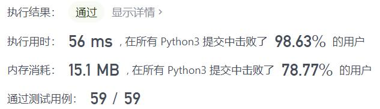
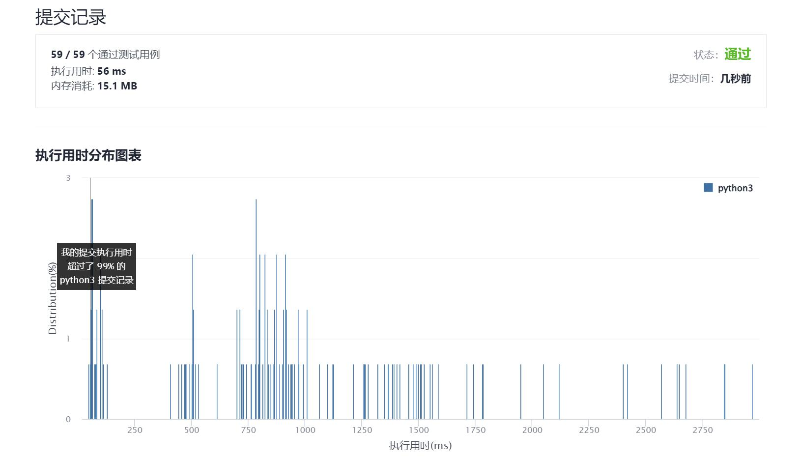

# 786-第K个最小的素数分数

Author：_Mumu

创建日期：2021/11/29

通过日期：2021/11/29

*****

踩过的坑：

1. 牛啊
2. 学习了如何写富比较方法并用于排序，但没想到用堆的算法居然比暴力排序还慢
3. 没想到的是这题居然也能用二分，而且每次都要计算小于二分点的分数个数看似多此一举实际上居然是最快的算法，太牛逼了

已解决：161/2447

*****

难度：困难

问题描述：

给你一个按递增顺序排序的数组 arr 和一个整数 k 。数组 arr 由 1 和若干 素数  组成，且其中所有整数互不相同。

对于每对满足 0 < i < j < arr.length 的 i 和 j ，可以得到分数 arr[i] / arr[j] 。

那么第 k 个最小的分数是多少呢?  以长度为 2 的整数数组返回你的答案, 这里 answer[0] == arr[i] 且 answer[1] == arr[j] 。

示例 1：

输入：arr = [1,2,3,5], k = 3
输出：[2,5]
解释：已构造好的分数,排序后如下所示: 
1/5, 1/3, 2/5, 1/2, 3/5, 2/3
很明显第三个最小的分数是 2/5
示例 2：

输入：arr = [1,7], k = 1
输出：[1,7]

提示：

2 <= arr.length <= 1000
1 <= arr[i] <= 3 * 104
arr[0] == 1
arr[i] 是一个 素数 ，i > 0
arr 中的所有数字 互不相同 ，且按 严格递增 排序
1 <= k <= arr.length * (arr.length - 1) / 2

来源：力扣（LeetCode）
链接：https://leetcode-cn.com/problems/k-th-smallest-prime-fraction
