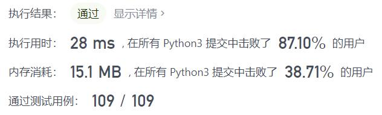

# 794-有效的井字游戏

Author：_Mumu

创建日期：2021/12/09

通过日期：2021/12/09

*****

踩过的坑：

1. 还可以
2. 核心是：`'X'`为先手，两玩家交替落子，只有走最后一步的玩家能成为赢家
3. 转化为具体的数字条件：记$X$​​为`'X'`的数量，记$O$​为`'O'`的数量，若二者不满足$O\le X\le O+1$，返回`False`；若$X=O$且先手胜，或者$X>O$且后手胜，由于两种情况走最后一步的都不是赢家，返回`False`；其余情况，返回`True`
4. 那么关键就在于统计两种棋子数与三子连珠（即获胜）情况
5. 使用长度为$8$的列表`lines`存储所有$3$行$3$列$2$条对角线上的获胜情况，遍历到格点`board[i][j]`，创建临时变量`score`，若格点为`'X'`，`score = 1`，若格点为`'O'`，`score = -1`，若为空格则`continue`跳过；`lines[i] += score`记录每一行的情况，`lines[j + 3] += score`记录每一列的情况，若`i == j`则为主对角线，`lines[6] += score`，若`i + j == 2`则为另一条对角线，`lines[7] += score`；遍历的同时顺便记录两种棋子各自的数量
6. 若`lines`中有$3$，则先手玩家胜，若有$-3$，则后手玩家胜；之后根据之前的逻辑进行分类判断即可

已解决：171/2449

*****

难度：中等

问题描述：

给你一个字符串数组 board 表示井字游戏的棋盘。当且仅当在井字游戏过程中，棋盘有可能达到 board 所显示的状态时，才返回 true 。

井字游戏的棋盘是一个 3 x 3 数组，由字符 ' '，'X' 和 'O' 组成。字符 ' ' 代表一个空位。

以下是井字游戏的规则：

玩家轮流将字符放入空位（' '）中。
玩家 1 总是放字符 'X' ，而玩家 2 总是放字符 'O' 。
'X' 和 'O' 只允许放置在空位中，不允许对已放有字符的位置进行填充。
当有 3 个相同（且非空）的字符填充任何行、列或对角线时，游戏结束。
当所有位置非空时，也算为游戏结束。
如果游戏结束，玩家不允许再放置字符。

示例 1：

输入：board = ["O  ","   ","   "]
输出：false
解释：玩家 1 总是放字符 "X" 。
示例 2：

输入：board = ["XOX"," X ","   "]
输出：false
解释：玩家应该轮流放字符。
示例 3：

输入：board = ["XXX","   ","OOO"]
输出：false
Example 4:

输入：board = ["XOX","O O","XOX"]
输出：true

提示：

board.length == 3
board[i].length == 3
board[i][j] 为 'X'、'O' 或 ' '

来源：力扣（LeetCode）
链接：https://leetcode-cn.com/problems/valid-tic-tac-toe-state
