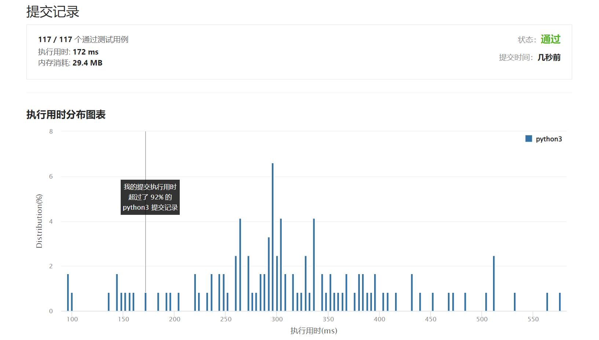

# 801-使序列递增的最小交换次数

Author：_Mumu

创建日期：2022/10/10

通过日期：2022/10/10

*****

踩过的坑：

1. 轻松愉快（指直接cv
1. 老是想不到用dp应该怎么办呢

已解决：487/2812

*****

难度：困难

问题描述：

我们有两个长度相等且不为空的整型数组 nums1 和 nums2 。在一次操作中，我们可以交换 nums1[i] 和 nums2[i]的元素。

例如，如果 nums1 = [1,2,3,8] ， nums2 =[5,6,7,4] ，你可以交换 i = 3 处的元素，得到 nums1 =[1,2,3,4] 和 nums2 =[5,6,7,8] 。
返回 使 nums1 和 nums2 严格递增 所需操作的最小次数 。

数组 arr 严格递增 且  arr[0] < arr[1] < arr[2] < ... < arr[arr.length - 1] 。

注意：

用例保证可以实现操作。

示例 1:

输入: nums1 = [1,3,5,4], nums2 = [1,2,3,7]
输出: 1
解释: 
交换 A[3] 和 B[3] 后，两个数组如下:
A = [1, 3, 5, 7] ， B = [1, 2, 3, 4]
两个数组均为严格递增的。
示例 2:

输入: nums1 = [0,3,5,8,9], nums2 = [2,1,4,6,9]
输出: 1

提示:

2 <= nums1.length <= 105
nums2.length == nums1.length
0 <= nums1[i], nums2[i] <= 2 * 105

来源：力扣（LeetCode）
链接：https://leetcode.cn/problems/minimum-swaps-to-make-sequences-increasing