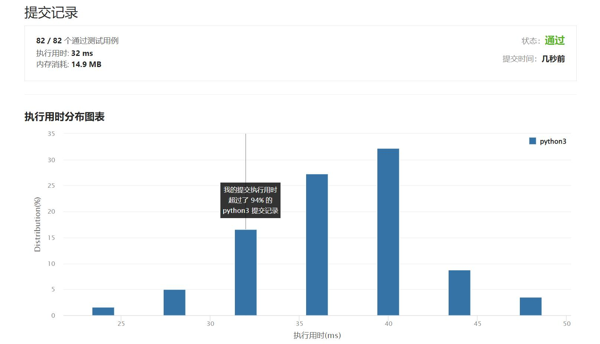

# 804-唯一摩尔斯密码词

Author：_Mumu

创建日期：2022/04/10

通过日期：2022/04/10

*****

踩过的坑：

1. 轻松愉快
1. 玩得太开心，差点忘记每日一题

已解决：305/2589

*****

难度：简单

问题描述：

国际摩尔斯密码定义一种标准编码方式，将每个字母对应于一个由一系列点和短线组成的字符串， 比如:

'a' 对应 ".-" ，
'b' 对应 "-..." ，
'c' 对应 "-.-." ，以此类推。
为了方便，所有 26 个英文字母的摩尔斯密码表如下：

[".-","-...","-.-.","-..",".","..-.","--.","....","..",".---","-.-",".-..","--","-.","---",".--.","--.-",".-.","...","-","..-","...-",".--","-..-","-.--","--.."]
给你一个字符串数组 words ，每个单词可以写成每个字母对应摩尔斯密码的组合。

例如，"cab" 可以写成 "-.-..--..." ，(即 "-.-." + ".-" + "-..." 字符串的结合)。我们将这样一个连接过程称作 单词翻译 。
对 words 中所有单词进行单词翻译，返回不同 单词翻译 的数量。

 

示例 1：

输入: words = ["gin", "zen", "gig", "msg"]
输出: 2
解释: 
各单词翻译如下:
"gin" -> "--...-."
"zen" -> "--...-."
"gig" -> "--...--."
"msg" -> "--...--."

共有 2 种不同翻译, "--...-." 和 "--...--.".
示例 2：

输入：words = ["a"]
输出：1

提示：

1 <= words.length <= 100
1 <= words[i].length <= 12
words[i] 由小写英文字母组成

来源：力扣（LeetCode）
链接：https://leetcode-cn.com/problems/unique-morse-code-words