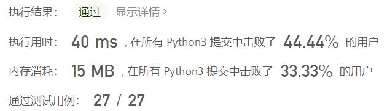
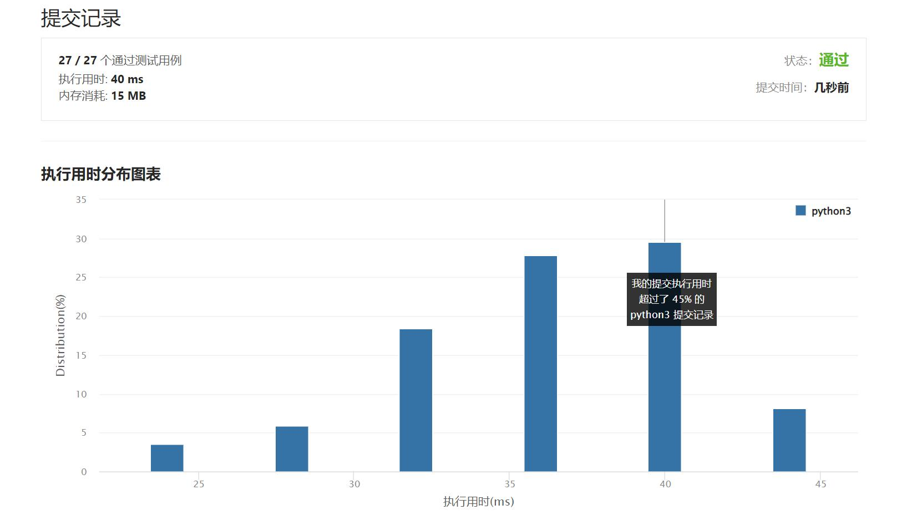

# 806-写字符串需要的行数

Author：_Mumu

创建日期：2022/04/12

通过日期：2022/04/12

*****

踩过的坑：

1. 轻松愉快
1. 就是要注意一下，最后一个单词放不下的时候要直接换行

已解决：307/2591

*****

难度：简单

问题描述：

我们要把给定的字符串 S 从左到右写到每一行上，每一行的最大宽度为100个单位，如果我们在写某个字母的时候会使这行超过了100 个单位，那么我们应该把这个字母写到下一行。我们给定了一个数组 widths ，这个数组 widths[0] 代表 'a' 需要的单位， widths[1] 代表 'b' 需要的单位，...， widths[25] 代表 'z' 需要的单位。

现在回答两个问题：至少多少行能放下S，以及最后一行使用的宽度是多少个单位？将你的答案作为长度为2的整数列表返回。

示例 1:
输入: 
widths = [10,10,10,10,10,10,10,10,10,10,10,10,10,10,10,10,10,10,10,10,10,10,10,10,10,10]
S = "abcdefghijklmnopqrstuvwxyz"
输出: [3, 60]
解释: 
所有的字符拥有相同的占用单位10。所以书写所有的26个字母，
我们需要2个整行和占用60个单位的一行。
示例 2:
输入: 
widths = [4,10,10,10,10,10,10,10,10,10,10,10,10,10,10,10,10,10,10,10,10,10,10,10,10,10]
S = "bbbcccdddaaa"
输出: [2, 4]
解释: 
除去字母'a'所有的字符都是相同的单位10，并且字符串 "bbbcccdddaa" 将会覆盖 9 * 10 + 2 * 4 = 98 个单位.
最后一个字母 'a' 将会被写到第二行，因为第一行只剩下2个单位了。
所以，这个答案是2行，第二行有4个单位宽度。

注:

字符串 S 的长度在 [1, 1000] 的范围。
S 只包含小写字母。
widths 是长度为 26的数组。
widths[i] 值的范围在 [2, 10]。

来源：力扣（LeetCode）
链接：https://leetcode-cn.com/problems/number-of-lines-to-write-string