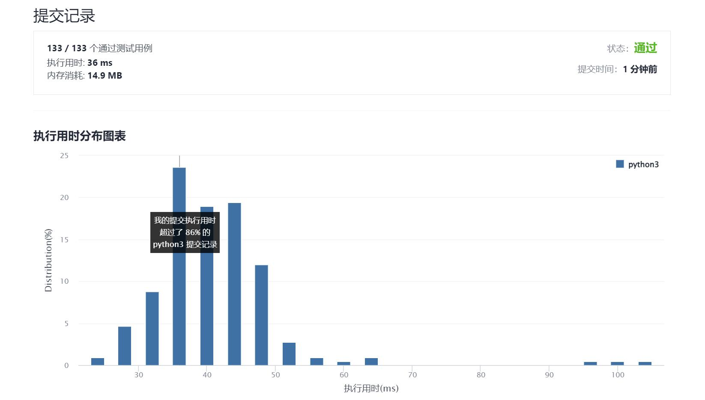

# 807-保持城市天际线

Author：_Mumu

创建日期：2021/12/13

通过日期：2021/12/13

*****

踩过的坑：

1. 轻松愉快！
2. 找到每行最大值，每列最大值，计算每个格点所在行和列最大值中较小的那个减去格点高度的差之和，即为所求
3. 虽然是中等但感觉应该是简单

已解决：175/2457

*****

难度：中等

问题描述：

在二维数组grid中，grid[i][j]代表位于某处的建筑物的高度。 我们被允许增加任何数量（不同建筑物的数量可能不同）的建筑物的高度。 高度 0 也被认为是建筑物。

最后，从新数组的所有四个方向（即顶部，底部，左侧和右侧）观看的“天际线”必须与原始数组的天际线相同。 城市的天际线是从远处观看时，由所有建筑物形成的矩形的外部轮廓。 请看下面的例子。

建筑物高度可以增加的最大总和是多少？

例子：
输入： grid = [[3,0,8,4],[2,4,5,7],[9,2,6,3],[0,3,1,0]]
输出： 35
解释： 
The grid is:
[ [3, 0, 8, 4], 
  [2, 4, 5, 7],
  [9, 2, 6, 3],
  [0, 3, 1, 0] ]

从数组竖直方向（即顶部，底部）看“天际线”是：[9, 4, 8, 7]
从水平水平方向（即左侧，右侧）看“天际线”是：[8, 7, 9, 3]

在不影响天际线的情况下对建筑物进行增高后，新数组如下：

gridNew = [ [8, 4, 8, 7],
            [7, 4, 7, 7],
            [9, 4, 8, 7],
            [3, 3, 3, 3] ]
说明:

1 < grid.length = grid[0].length <= 50。
 grid[i][j] 的高度范围是： [0, 100]。
一座建筑物占据一个grid[i][j]：换言之，它们是 1 x 1 x grid[i][j] 的长方体。

来源：力扣（LeetCode）
链接：https://leetcode-cn.com/problems/max-increase-to-keep-city-skyline
