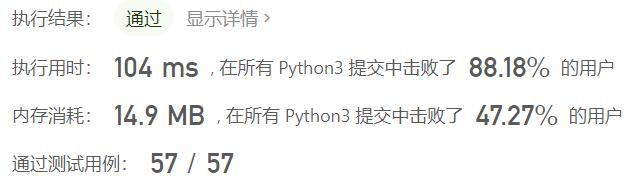
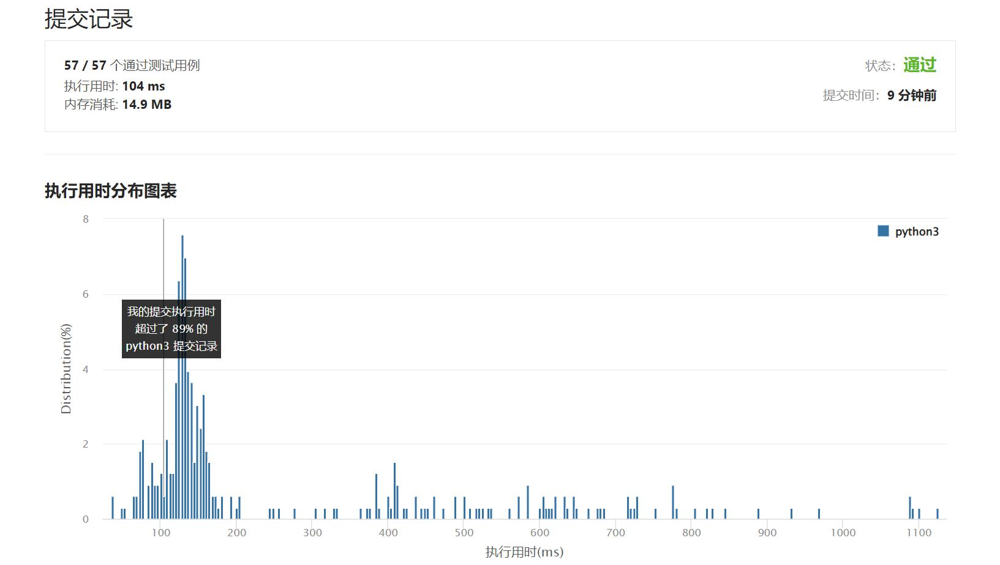

# 812-最大三角形面积

Author：_Mumu

创建日期：2022/05/15

通过日期：2022/05/15

*****

踩过的坑：

1. 轻松愉快

已解决：340/2638

*****

难度：简单

问题描述：

给定包含多个点的集合，从其中取三个点组成三角形，返回能组成的最大三角形的面积。

示例:
输入: points = [[0,0],[0,1],[1,0],[0,2],[2,0]]
输出: 2
解释: 
这五个点如下图所示。组成的橙色三角形是最大的，面积为2。

注意:

3 <= points.length <= 50.
不存在重复的点。
 -50 <= points[i][j] <= 50.
结果误差值在 10^-6 以内都认为是正确答案。

来源：力扣（LeetCode）
链接：https://leetcode.cn/problems/largest-triangle-area