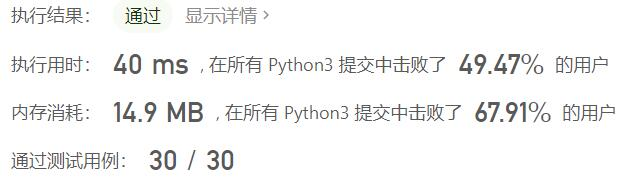

# 814-二叉树剪枝

Author：_Mumu

创建日期：2022/07/21

通过日期：2022/07/21

*****

踩过的坑：

1. 轻松愉快
1. 简单的dfs

已解决：407/2711

*****

难度：中等

问题描述：

给你二叉树的根结点 root ，此外树的每个结点的值要么是 0 ，要么是 1 。

返回移除了所有不包含 1 的子树的原二叉树。

节点 node 的子树为 node 本身加上所有 node 的后代。

 

示例 1：

输入：root = [1,null,0,0,1]
输出：[1,null,0,null,1]
解释：
只有红色节点满足条件“所有不包含 1 的子树”。 右图为返回的答案。
示例 2：

输入：root = [1,0,1,0,0,0,1]
输出：[1,null,1,null,1]
示例 3：

输入：root = [1,1,0,1,1,0,1,0]
输出：[1,1,0,1,1,null,1]

提示：

树中节点的数目在范围 [1, 200] 内
Node.val 为 0 或 1

来源：力扣（LeetCode）
链接：https://leetcode.cn/problems/binary-tree-pruning