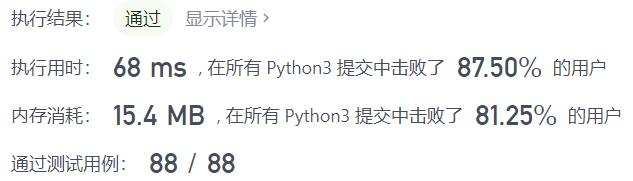
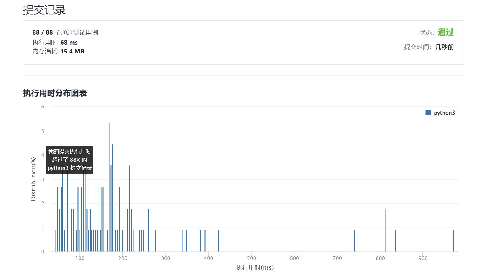

# 825-适龄的朋友

Author：_Mumu

创建日期：2021/12/27

通过日期：2021/12/27

*****

踩过的坑：

1. 想鸡腿了
2. 又忘记利用题目数据范围了，使用计数就变得贼方便了

已解决：189/2477

*****

难度：中等

问题描述：

在社交媒体网站上有 n 个用户。给你一个整数数组 ages ，其中 ages[i] 是第 i 个用户的年龄。

如果下述任意一个条件为真，那么用户 x 将不会向用户 y（x != y）发送好友请求：

age[y] <= 0.5 * age[x] + 7
age[y] > age[x]
age[y] > 100 && age[x] < 100
否则，x 将会向 y 发送一条好友请求。

注意，如果 x 向 y 发送一条好友请求，y 不必也向 x 发送一条好友请求。另外，用户不会向自己发送好友请求。

返回在该社交媒体网站上产生的好友请求总数。

 

示例 1：

输入：ages = [16,16]
输出：2
解释：2 人互发好友请求。
示例 2：

输入：ages = [16,17,18]
输出：2
解释：产生的好友请求为 17 -> 16 ，18 -> 17 。
示例 3：

输入：ages = [20,30,100,110,120]
输出：3
解释：产生的好友请求为 110 -> 100 ，120 -> 110 ，120 -> 100 。

提示：

n == ages.length
1 <= n <= 2 * 104
1 <= ages[i] <= 120

来源：力扣（LeetCode）
链接：https://leetcode-cn.com/problems/friends-of-appropriate-ages
