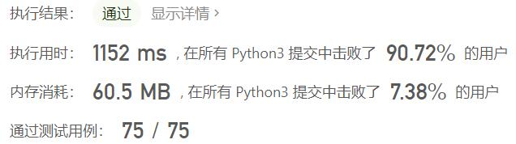

# 827-最大人工岛

Author：_Mumu

创建日期：2022/09/18

通过日期：2022/09/18

*****

踩过的坑：

1. 轻松愉快
1. 直接照搬了部分华为笔试时写的代码哈哈哈哈哈
1. 然后想到了当时一直没想到的最后解决思路，绝

已解决：466/2782

*****

难度：困难

问题描述：

给你一个大小为 n x n 二进制矩阵 grid 。最多 只能将一格 0 变成 1 。

返回执行此操作后，grid 中最大的岛屿面积是多少？

岛屿 由一组上、下、左、右四个方向相连的 1 形成。

 

示例 1:

输入: grid = [[1, 0], [0, 1]]
输出: 3
解释: 将一格0变成1，最终连通两个小岛得到面积为 3 的岛屿。
示例 2:

输入: grid = [[1, 1], [1, 0]]
输出: 4
解释: 将一格0变成1，岛屿的面积扩大为 4。
示例 3:

输入: grid = [[1, 1], [1, 1]]
输出: 4
解释: 没有0可以让我们变成1，面积依然为 4。

提示：

n == grid.length
n == grid[i].length
1 <= n <= 500
grid[i][j] 为 0 或 1

来源：力扣（LeetCode）
链接：https://leetcode.cn/problems/making-a-large-island