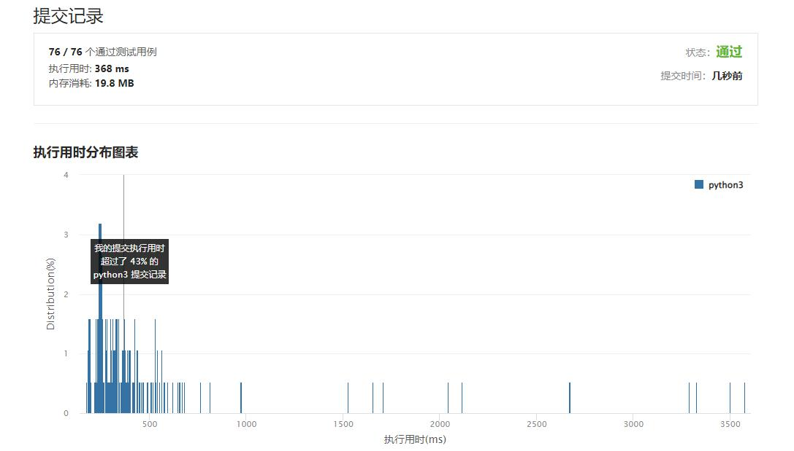

# 828-统计子串中的唯一字符

Author：_Mumu

创建日期：2022/09/06

通过日期：2022/09/06

*****

踩过的坑：

1. 轻松愉快（指直接cv
2. 分别统计字符的贡献可太妙了

已解决：454/2768

*****

难度：困难

问题描述：

我们定义了一个函数 countUniqueChars(s) 来统计字符串 s 中的唯一字符，并返回唯一字符的个数。

例如：s = "LEETCODE" ，则其中 "L", "T","C","O","D" 都是唯一字符，因为它们只出现一次，所以 countUniqueChars(s) = 5 。

本题将会给你一个字符串 s ，我们需要返回 countUniqueChars(t) 的总和，其中 t 是 s 的子字符串。输入用例保证返回值为 32 位整数。

注意，某些子字符串可能是重复的，但你统计时也必须算上这些重复的子字符串（也就是说，你必须统计 s 的所有子字符串中的唯一字符）。

 

示例 1：

输入: s = "ABC"
输出: 10
解释: 所有可能的子串为："A","B","C","AB","BC" 和 "ABC"。
     其中，每一个子串都由独特字符构成。
     所以其长度总和为：1 + 1 + 1 + 2 + 2 + 3 = 10
示例 2：

输入: s = "ABA"
输出: 8
解释: 除了 countUniqueChars("ABA") = 1 之外，其余与示例 1 相同。
示例 3：

输入：s = "LEETCODE"
输出：92

提示：

1 <= s.length <= 10^5
s 只包含大写英文字符

来源：力扣（LeetCode）
链接：https://leetcode.cn/problems/count-unique-characters-of-all-substrings-of-a-given-string