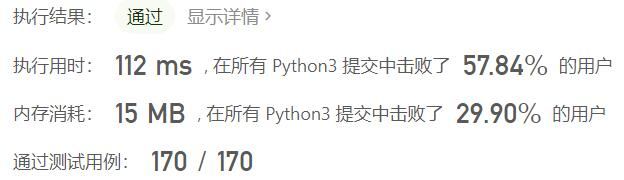
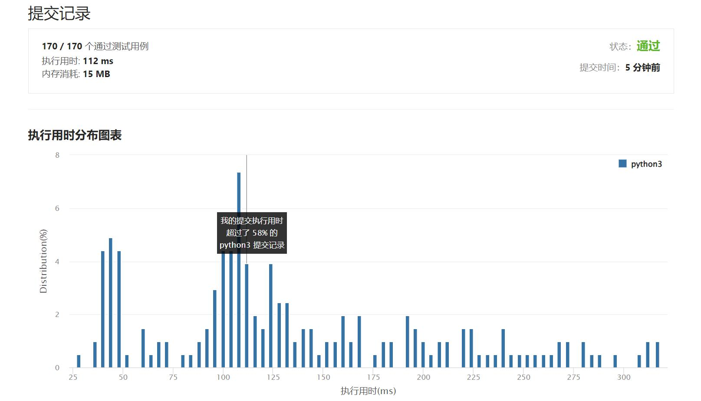

# 829-连续整数求和

Author：_Mumu

创建日期：2022/06/03

通过日期：2022/06/03

*****

踩过的坑：

1. 轻松愉快
1. 主场数学题，直接从等差数列求和公式解，枚举项数即可

已解决：359/2658

*****

难度：困难

问题描述：

给定一个正整数 n，返回 连续正整数满足所有数字之和为 n 的组数 。 

 

示例 1:

输入: n = 5
输出: 2
解释: 5 = 2 + 3，共有两组连续整数([5],[2,3])求和后为 5。
示例 2:

输入: n = 9
输出: 3
解释: 9 = 4 + 5 = 2 + 3 + 4
示例 3:

输入: n = 15
输出: 4
解释: 15 = 8 + 7 = 4 + 5 + 6 = 1 + 2 + 3 + 4 + 5

提示:

1 <= n <= 109

来源：力扣（LeetCode）
链接：https://leetcode.cn/problems/consecutive-numbers-sum