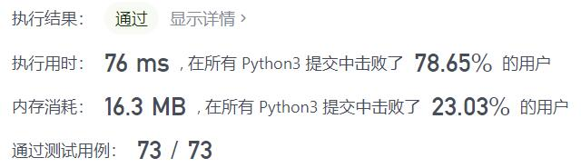
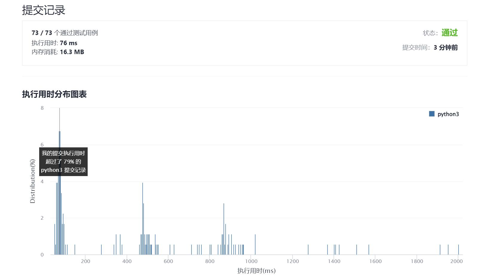

# 846-一手顺子

Author：_Mumu

创建日期：2021/12/30

通过日期：2021/12/30

*****

踩过的坑：

1. 好吧，真就暴力啊

已解决：192/2477

*****

难度：中等

问题描述：

Alice 手中有一把牌，她想要重新排列这些牌，分成若干组，使每一组的牌数都是 groupSize ，并且由 groupSize 张连续的牌组成。

给你一个整数数组 hand 其中 hand[i] 是写在第 i 张牌，和一个整数 groupSize 。如果她可能重新排列这些牌，返回 true ；否则，返回 false 。

 

示例 1：

输入：hand = [1,2,3,6,2,3,4,7,8], groupSize = 3
输出：true
解释：Alice 手中的牌可以被重新排列为 [1,2,3]，[2,3,4]，[6,7,8]。
示例 2：

输入：hand = [1,2,3,4,5], groupSize = 4
输出：false
解释：Alice 手中的牌无法被重新排列成几个大小为 4 的组。

提示：

1 <= hand.length <= 104
0 <= hand[i] <= 109
1 <= groupSize <= hand.length

来源：力扣（LeetCode）
链接：https://leetcode-cn.com/problems/hand-of-straights
