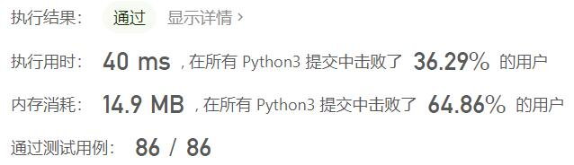
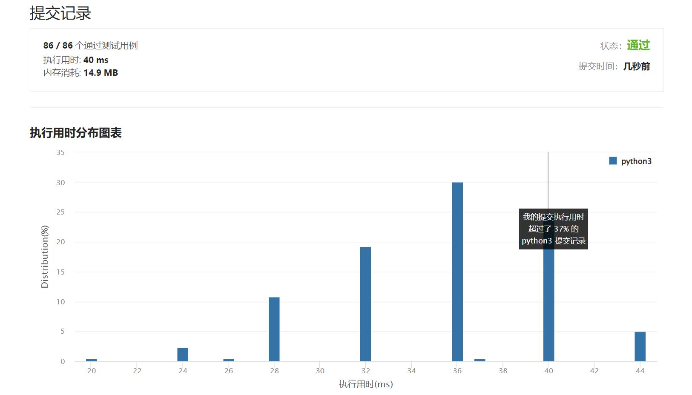

# 856-括号的分数

Author：_Mumu

创建日期：2022/10/09

通过日期：2022/10/09

*****

踩过的坑：

1. 轻松愉快
1. 我知道应该可以用栈解决，但是没想到可以用栈存分数，妙啊

已解决：486/2808

*****

难度：中等

问题描述：

给定一个平衡括号字符串 S，按下述规则计算该字符串的分数：

() 得 1 分。
AB 得 A + B 分，其中 A 和 B 是平衡括号字符串。
(A) 得 2 * A 分，其中 A 是平衡括号字符串。

示例 1：

输入： "()"
输出： 1
示例 2：

输入： "(())"
输出： 2
示例 3：

输入： "()()"
输出： 2
示例 4：

输入： "(()(()))"
输出： 6

提示：

S 是平衡括号字符串，且只含有 ( 和 ) 。
2 <= S.length <= 50

来源：力扣（LeetCode）
链接：https://leetcode.cn/problems/score-of-parentheses