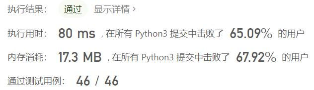
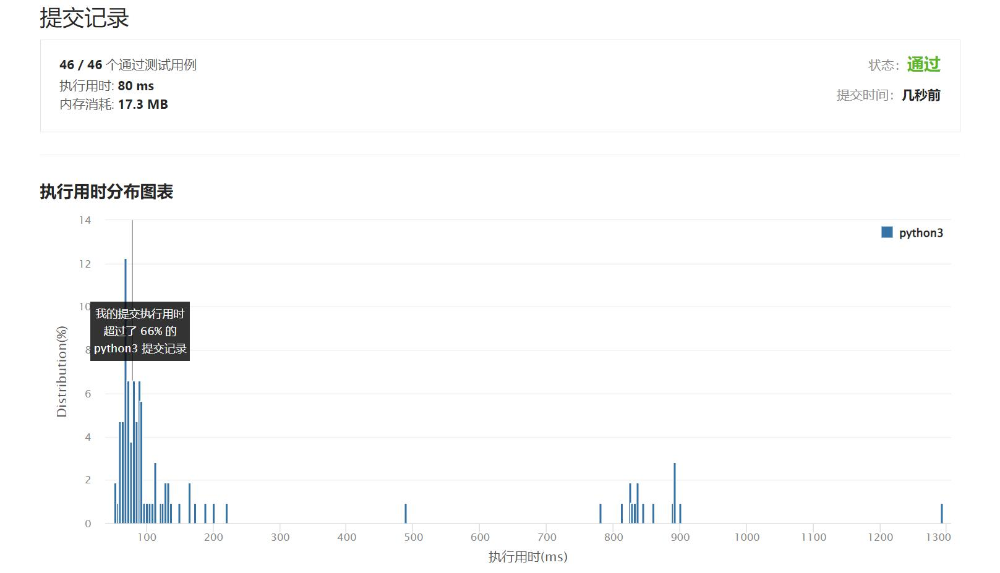

# 857-雇佣K名工人的最低成本

Author：_Mumu

创建日期：2022/09/11

通过日期：2022/09/11

*****

踩过的坑：

1. 轻松愉快（指直接cv

已解决：459/2773

*****

难度：困难

问题描述：

有 n 名工人。 给定两个数组 quality 和 wage ，其中，quality[i] 表示第 i 名工人的工作质量，其最低期望工资为 wage[i] 。

现在我们想雇佣 k 名工人组成一个工资组。在雇佣 一组 k 名工人时，我们必须按照下述规则向他们支付工资：

对工资组中的每名工人，应当按其工作质量与同组其他工人的工作质量的比例来支付工资。
工资组中的每名工人至少应当得到他们的最低期望工资。
给定整数 k ，返回 组成满足上述条件的付费群体所需的最小金额 。在实际答案的 10-5 以内的答案将被接受。。

 

示例 1：

输入： quality = [10,20,5], wage = [70,50,30], k = 2
输出： 105.00000
解释： 我们向 0 号工人支付 70，向 2 号工人支付 35。
示例 2：

输入： quality = [3,1,10,10,1], wage = [4,8,2,2,7], k = 3
输出： 30.66667
解释： 我们向 0 号工人支付 4，向 2 号和 3 号分别支付 13.33333。

提示：

n == quality.length == wage.length
1 <= k <= n <= 104
1 <= quality[i], wage[i] <= 104

来源：力扣（LeetCode）
链接：https://leetcode.cn/problems/minimum-cost-to-hire-k-workers