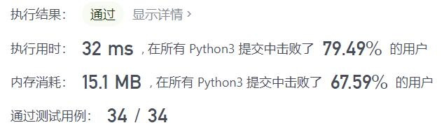

# 859-亲密字符串

Author：_Mumu

创建日期：2021/11/23

通过日期：2021/11/23

*****

踩过的坑：

1. 还是蛮简单的
2. 没啥大坑，就是记得有重复字母的时候自己和自己也是亲密字符串，没有重复字母的时候就不是

已解决：155/2436

*****

难度：简单

问题描述：

给你两个字符串 s 和 goal ，只要我们可以通过交换 s 中的两个字母得到与 goal 相等的结果，就返回 true ；否则返回 false 。

交换字母的定义是：取两个下标 i 和 j （下标从 0 开始）且满足 i != j ，接着交换 s[i] 和 s[j] 处的字符。

例如，在 "abcd" 中交换下标 0 和下标 2 的元素可以生成 "cbad" 。

示例 1：

输入：s = "ab", goal = "ba"
输出：true
解释：你可以交换 s[0] = 'a' 和 s[1] = 'b' 生成 "ba"，此时 s 和 goal 相等。
示例 2：

输入：s = "ab", goal = "ab"
输出：false
解释：你只能交换 s[0] = 'a' 和 s[1] = 'b' 生成 "ba"，此时 s 和 goal 不相等。
示例 3：

输入：s = "aa", goal = "aa"
输出：true
解释：你可以交换 s[0] = 'a' 和 s[1] = 'a' 生成 "aa"，此时 s 和 goal 相等。
示例 4：

输入：s = "aaaaaaabc", goal = "aaaaaaacb"
输出：true

提示：

1 <= s.length, goal.length <= 2 * 104
s 和 goal 由小写英文字母组成

来源：力扣（LeetCode）
链接：https://leetcode-cn.com/problems/buddy-strings
