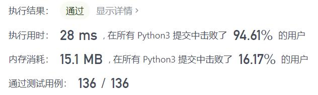
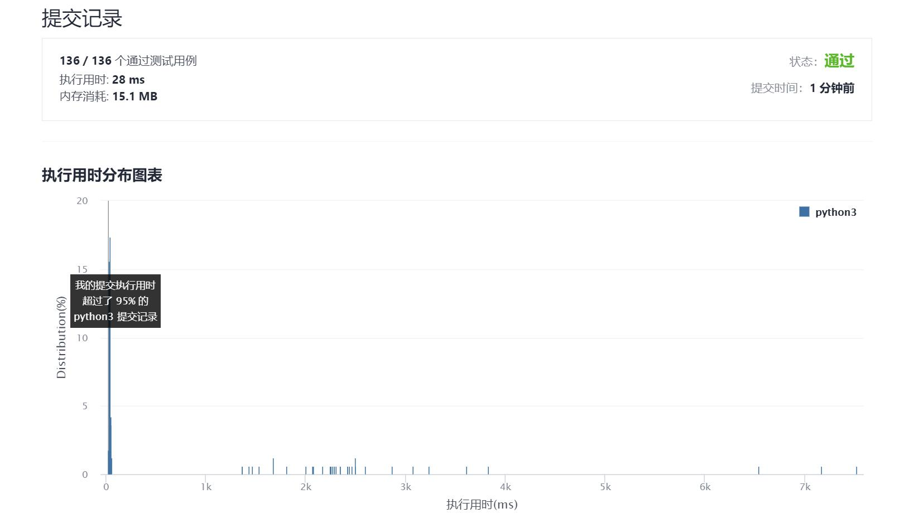

# 869-重新排序得到2的幂

Author：_Mumu

创建日期：2021/10/28

通过日期：2021/10/28

*****

踩过的坑：

1. 笑死，偷鸡成功
2. 一看数据范围，喔~这不是能枚举2的幂嘛
3. 然后就想着先存好2的幂的字符串的全排列，直接判断输入是否在这个集合里
4. 但是不行，这样太复杂了，那就，枚举输入的排列然后看是否与2的幂有交集
5. 好像也不太好
6. 然后就想到，排列嘛，直接存每种数字有多少个不就好了嘛！然后对输入也检查每种数字有多少个，再看是否有匹配的项，完美！
7. 一看题解，笑死，就是方法二

已解决：131/2407

*****

难度：中等

问题描述：

给定正整数 N ，我们按任何顺序（包括原始顺序）将数字重新排序，注意其前导数字不能为零。

如果我们可以通过上述方式得到 2 的幂，返回 true；否则，返回 false。

 

示例 1：

输入：1
输出：true
示例 2：

输入：10
输出：false
示例 3：

输入：16
输出：true
示例 4：

输入：24
输出：false
示例 5：

输入：46
输出：true

提示：

1 <= N <= 10^9

来源：力扣（LeetCode）
链接：https://leetcode-cn.com/problems/reordered-power-of-2
