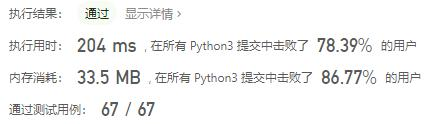
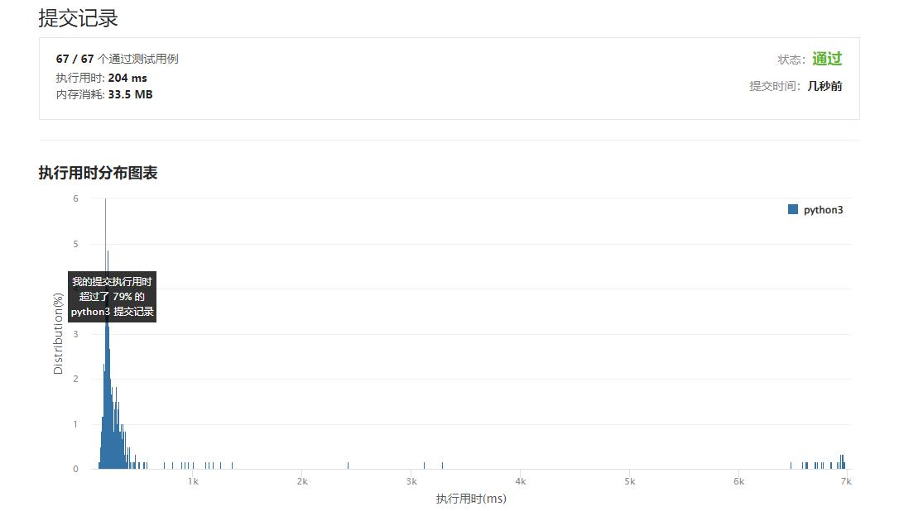

# 870-优势洗牌

Author：_Mumu

创建日期：2022/10/08

通过日期：2022/10/08

*****

踩过的坑：

1. 轻松愉快（指直接cv

已解决：485/2808

*****

难度：中等

问题描述：

给定两个大小相等的数组 nums1 和 nums2，nums1 相对于 nums 的优势可以用满足 nums1[i] > nums2[i] 的索引 i 的数目来描述。

返回 nums1 的任意排列，使其相对于 nums2 的优势最大化。

 

示例 1：

输入：nums1 = [2,7,11,15], nums2 = [1,10,4,11]
输出：[2,11,7,15]
示例 2：

输入：nums1 = [12,24,8,32], nums2 = [13,25,32,11]
输出：[24,32,8,12]

提示：

1 <= nums1.length <= 105
nums2.length == nums1.length
0 <= nums1[i], nums2[i] <= 109

来源：力扣（LeetCode）
链接：https://leetcode.cn/problems/advantage-shuffle