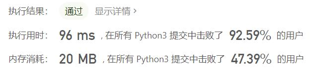
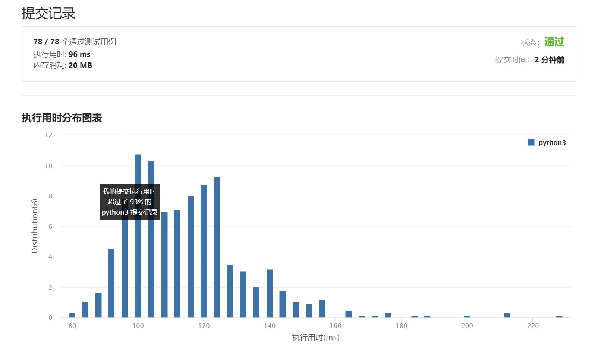

# 881-救生艇

Author：_Mumu

创建日期：2021/8/26

通过日期：2021/8/26

*****

踩过的坑：

1. 第一反应排序，对最轻的人，找到和他一起乘船不会超重的最重的人
2. 但是忘记了比按这个想法找到的人更重的人都只能单独乘一艘船，所以卡住了
3. 看了题解恍然大悟，chuachuachua就写好了

已解决：68/2326

*****

难度：中等

问题描述：

第 i 个人的体重为 people[i]，每艘船可以承载的最大重量为 limit。

每艘船最多可同时载两人，但条件是这些人的重量之和最多为 limit。

返回载到每一个人所需的最小船数。(保证每个人都能被船载)。

 

示例 1：

输入：people = [1,2], limit = 3
输出：1
解释：1 艘船载 (1, 2)
示例 2：

输入：people = [3,2,2,1], limit = 3
输出：3
解释：3 艘船分别载 (1, 2), (2) 和 (3)
示例 3：

输入：people = [3,5,3,4], limit = 5
输出：4
解释：4 艘船分别载 (3), (3), (4), (5)
提示：

1 <= people.length <= 50000
1 <= people[i] <= limit <= 30000

来源：力扣（LeetCode）
链接：https://leetcode-cn.com/problems/boats-to-save-people
