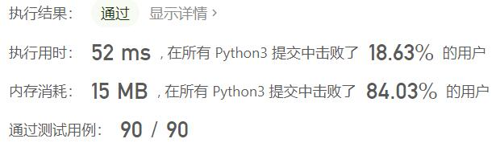
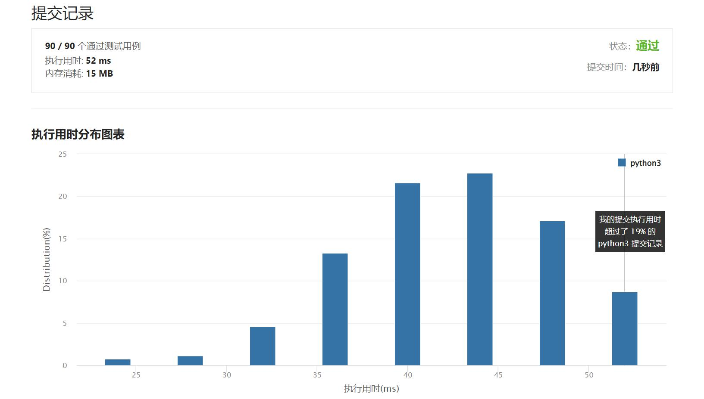

# 883-三维形体投影面积

Author：_Mumu

创建日期：2022/04/26

通过日期：2022/04/26

*****

踩过的坑：

1. 轻松愉快

已解决：321/2619

*****

难度：简单

问题描述：

在 n x n 的网格 grid 中，我们放置了一些与 x，y，z 三轴对齐的 1 x 1 x 1 立方体。

每个值 v = grid[i][j] 表示 v 个正方体叠放在单元格 (i, j) 上。

现在，我们查看这些立方体在 xy 、yz 和 zx 平面上的投影。

投影 就像影子，将 三维 形体映射到一个 二维 平面上。从顶部、前面和侧面看立方体时，我们会看到“影子”。

返回 所有三个投影的总面积 。

 

示例 1：

输入：[[1,2],[3,4]]
输出：17
解释：这里有该形体在三个轴对齐平面上的三个投影(“阴影部分”)。
示例 2:

输入：grid = [[2]]
输出：5
示例 3：

输入：[[1,0],[0,2]]
输出：8

提示：

n == grid.length == grid[i].length
1 <= n <= 50
0 <= grid[i][j] <= 50

来源：力扣（LeetCode）
链接：https://leetcode-cn.com/problems/projection-area-of-3d-shapes