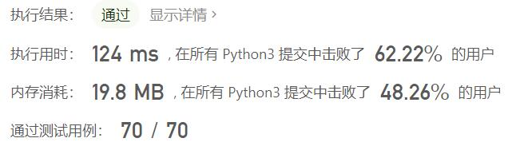
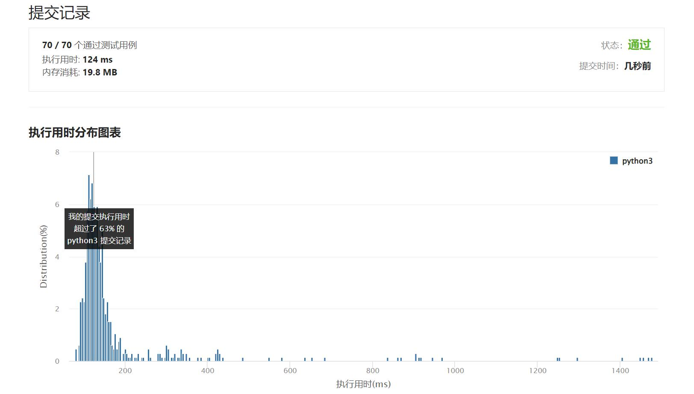

# 886-可能的二分法

Author：_Mumu

创建日期：2022/10/16

通过日期：2022/10/16

*****

踩过的坑：

1. 轻松愉快
1. 不就是二部图嘛

已解决：493/2817

*****

难度：中等

问题描述：

给定一组 n 人（编号为 1, 2, ..., n）， 我们想把每个人分进任意大小的两组。每个人都可能不喜欢其他人，那么他们不应该属于同一组。

给定整数 n 和数组 dislikes ，其中 dislikes[i] = [ai, bi] ，表示不允许将编号为 ai 和  bi的人归入同一组。当可以用这种方法将所有人分进两组时，返回 true；否则返回 false。

 

示例 1：

输入：n = 4, dislikes = [[1,2],[1,3],[2,4]]
输出：true
解释：group1 [1,4], group2 [2,3]
示例 2：

输入：n = 3, dislikes = [[1,2],[1,3],[2,3]]
输出：false
示例 3：

输入：n = 5, dislikes = [[1,2],[2,3],[3,4],[4,5],[1,5]]
输出：false

提示：

1 <= n <= 2000
0 <= dislikes.length <= 104
dislikes[i].length == 2
1 <= dislikes[i][j] <= n
ai < bi
dislikes 中每一组都 不同

来源：力扣（LeetCode）
链接：https://leetcode.cn/problems/possible-bipartition