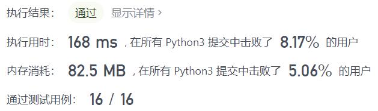
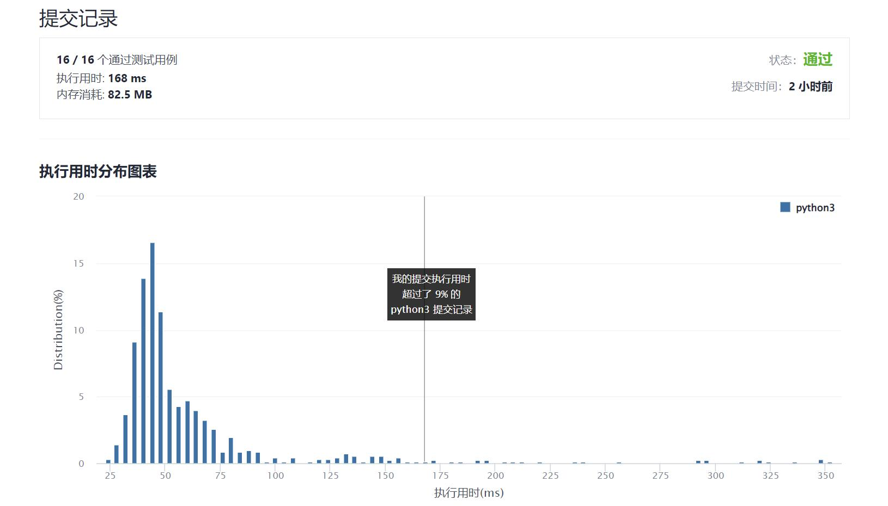

# 89-格雷编码

Author：_Mumu

创建日期：2022/01/08

通过日期：2022/01/08

*****

踩过的坑：

1. 二进制位只相差一位说明二者的差一定是2的幂，第一反应写成暴力的深度优先搜索了，并利用了题目的数据范围，判别两数字二进制只相差一位的算法可以降低到$O(1)$，但其实这在整个dfs中也只用了一次而已——判断首位和末位的差，而其实这也多此一举，首位一定是0，末位就只能是2的幂了嘛
2. 看了题解才发现可以有一些巧妙的生成方法，然后用对称生成写了一个递归

已解决：201/2483

*****

难度：中等

问题描述：

n 位格雷码序列 是一个由 2n 个整数组成的序列，其中：
每个整数都在范围 [0, 2n - 1] 内（含 0 和 2n - 1）
第一个整数是 0
一个整数在序列中出现 不超过一次
每对 相邻 整数的二进制表示 恰好一位不同 ，且
第一个 和 最后一个 整数的二进制表示 恰好一位不同
给你一个整数 n ，返回任一有效的 n 位格雷码序列 。

 

示例 1：

输入：n = 2
输出：[0,1,3,2]
解释：
[0,1,3,2] 的二进制表示是 [00,01,11,10] 。
- 00 和 01 有一位不同
- 01 和 11 有一位不同
- 11 和 10 有一位不同
- 10 和 00 有一位不同
[0,2,3,1] 也是一个有效的格雷码序列，其二进制表示是 [00,10,11,01] 。
- 00 和 10 有一位不同
- 10 和 11 有一位不同
- 11 和 01 有一位不同
- 01 和 00 有一位不同
示例 2：

输入：n = 1
输出：[0,1]

提示：

1 <= n <= 16

来源：力扣（LeetCode）
链接：https://leetcode-cn.com/problems/gray-code
