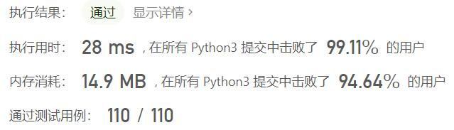
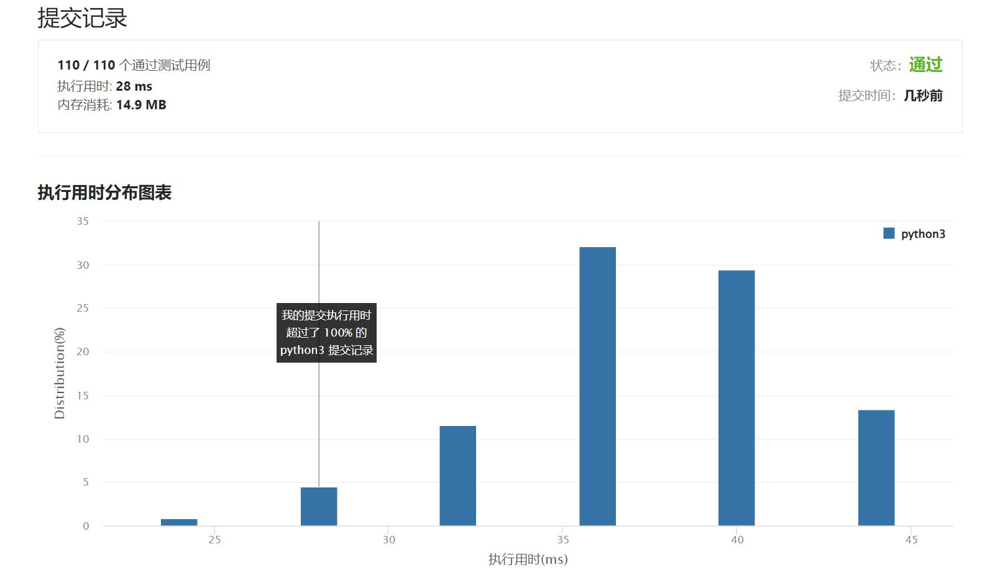

# 899-有序队列

Author：_Mumu

创建日期：2022/08/03

通过日期：2022/08/03

*****

踩过的坑：

1. 轻松愉快
1. 《困难》
1. $k=2$，就可以通过一定操作交换任意两个字符的位置，那么必然可以得到字符串全排列，其中最小的就是从小到大排序后字符串
1. $k\gt2$与$k=2$等效
1. $k=1$可以循环一遍比较，但用最小表示法时间复杂度更低

已解决：420/2727

*****

难度：困难

问题描述：

给定一个字符串 s 和一个整数 k 。你可以从 s 的前 k 个字母中选择一个，并把它加到字符串的末尾。

返回 在应用上述步骤的任意数量的移动后，字典上最小的字符串 。

 

示例 1：

输入：s = "cba", k = 1
输出："acb"
解释：
在第一步中，我们将第一个字符（“c”）移动到最后，获得字符串 “bac”。
在第二步中，我们将第一个字符（“b”）移动到最后，获得最终结果 “acb”。
示例 2：

输入：s = "baaca", k = 3
输出："aaabc"
解释：
在第一步中，我们将第一个字符（“b”）移动到最后，获得字符串 “aacab”。
在第二步中，我们将第三个字符（“c”）移动到最后，获得最终结果 “aaabc”。

提示：

1 <= k <= S.length <= 1000
s 只由小写字母组成。

来源：力扣（LeetCode）
链接：https://leetcode.cn/problems/orderly-queue