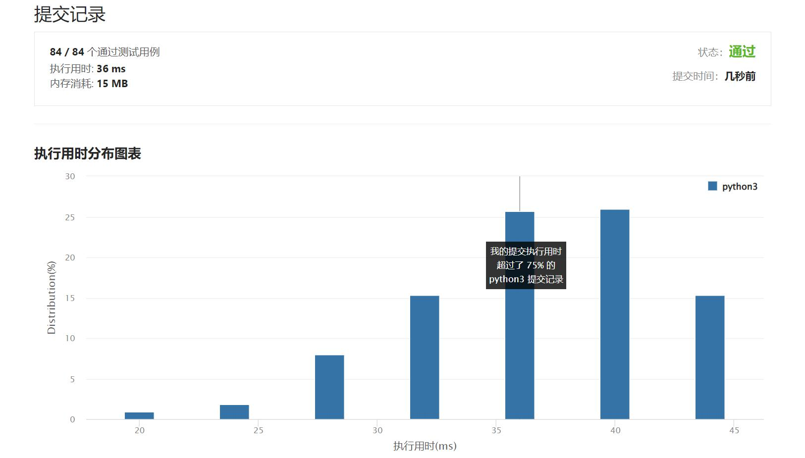

# 902-最大为N的数字组合

Author：_Mumu

创建日期：2022/10/18

通过日期：2022/10/18

*****

踩过的坑：

1. 轻松愉快（指直接cv

已解决：495/2821

*****

难度：困难

问题描述：

给定一个按 非递减顺序 排列的数字数组 digits 。你可以用任意次数 digits[i] 来写的数字。例如，如果 digits = ['1','3','5']，我们可以写数字，如 '13', '551', 和 '1351315'。

返回 可以生成的小于或等于给定整数 n 的正整数的个数 。

 

示例 1：

输入：digits = ["1","3","5","7"], n = 100
输出：20
解释：
可写出的 20 个数字是：
1, 3, 5, 7, 11, 13, 15, 17, 31, 33, 35, 37, 51, 53, 55, 57, 71, 73, 75, 77.
示例 2：

输入：digits = ["1","4","9"], n = 1000000000
输出：29523
解释：
我们可以写 3 个一位数字，9 个两位数字，27 个三位数字，
81 个四位数字，243 个五位数字，729 个六位数字，
2187 个七位数字，6561 个八位数字和 19683 个九位数字。
总共，可以使用D中的数字写出 29523 个整数。
示例 3:

输入：digits = ["7"], n = 8
输出：1

提示：

1 <= digits.length <= 9
digits[i].length == 1
digits[i] 是从 '1' 到 '9' 的数
digits 中的所有值都 不同 
digits 按 非递减顺序 排列
1 <= n <= 109

来源：力扣（LeetCode）
链接：https://leetcode.cn/problems/numbers-at-most-n-given-digit-set