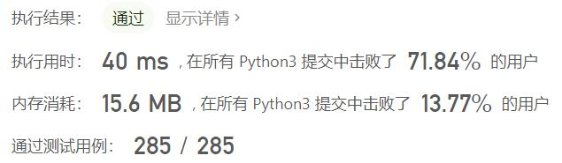
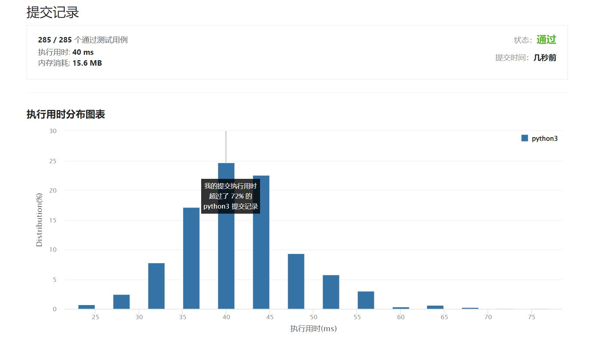

# 905-按奇偶排序数组

Author：_Mumu

创建日期：2022/04/28

通过日期：2022/04/28

*****

踩过的坑：

1. 轻松愉快

已解决：323/2619

*****

难度：简单

问题描述：

给你一个整数数组 nums，将 nums 中的的所有偶数元素移动到数组的前面，后跟所有奇数元素。

返回满足此条件的 任一数组 作为答案。

 

示例 1：

输入：nums = [3,1,2,4]
输出：[2,4,3,1]
解释：[4,2,3,1]、[2,4,1,3] 和 [4,2,1,3] 也会被视作正确答案。
示例 2：

输入：nums = [0]
输出：[0]

提示：

1 <= nums.length <= 5000
0 <= nums[i] <= 5000

来源：力扣（LeetCode）
链接：https://leetcode-cn.com/problems/sort-array-by-parity