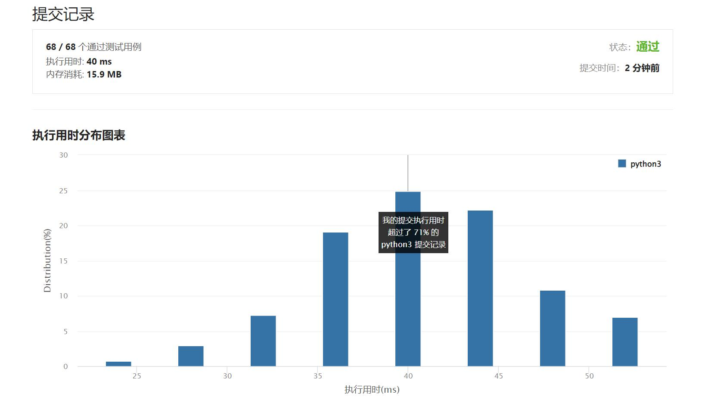

# 908-最小差值I

Author：_Mumu

创建日期：2022/04/30

通过日期：2022/04/30

*****

踩过的坑：

1. 轻松愉快

已解决：325/2620

*****

难度：简单

问题描述：

给你一个整数数组 nums，和一个整数 k 。

在一个操作中，您可以选择 0 <= i < nums.length 的任何索引 i 。将 nums[i] 改为 nums[i] + x ，其中 x 是一个范围为 [-k, k] 的整数。对于每个索引 i ，最多 只能 应用 一次 此操作。

nums 的 分数 是 nums 中最大和最小元素的差值。 

在对  nums 中的每个索引最多应用一次上述操作后，返回 nums 的最低 分数 。

 

示例 1：

输入：nums = [1], k = 0
输出：0
解释：分数是 max(nums) - min(nums) = 1 - 1 = 0。
示例 2：

输入：nums = [0,10], k = 2
输出：6
解释：将 nums 改为 [2,8]。分数是 max(nums) - min(nums) = 8 - 2 = 6。
示例 3：

输入：nums = [1,3,6], k = 3
输出：0
解释：将 nums 改为 [4,4,4]。分数是 max(nums) - min(nums) = 4 - 4 = 0。

提示：

1 <= nums.length <= 104
0 <= nums[i] <= 104
0 <= k <= 104

来源：力扣（LeetCode）
链接：https://leetcode-cn.com/problems/smallest-range-i