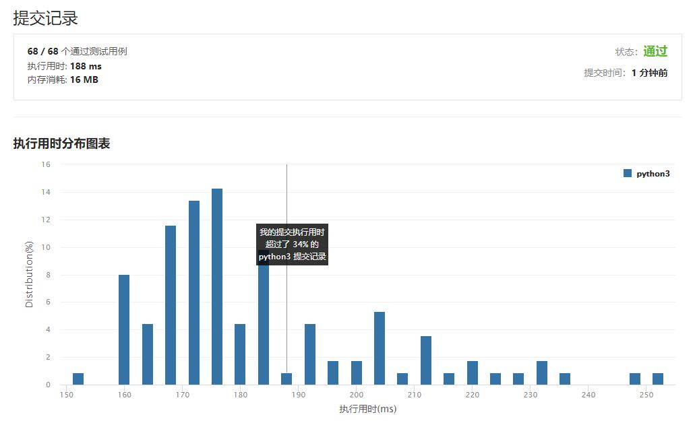

# 910-最小差值II

Author：_Mumu

创建日期：2021/2/20

通过日期：2021/2/20

*****

踩过的坑：

1. 最开始没想到用sort，思考的时候直接把自己绕进去了，看了解答才想起来还能用sort，傻了QAQ
2. 想法是从小到大排列后，在原列表个元素选择$+K$和$-K$就相当于原列表全体$-K$后在各元素选择$+2K$和$+0$，res的初始值设定为$A_n-A_1$即$A[-1]-A[0]$，loop列表，对前$i$项都做$+2K$，则此时列表最大元在$A_i+2K$和$A_n$中取，最小元在$A_0+2K$和$A_{i+1}$中取，计算最大减最小，更新res
3. 自己的算法和最快的算法思路是一样的，开心o(*￣▽￣*)ブ

已解决：9/1973

*****

难度：中等

问题描述：

给你一个整数数组 A，对于每个整数 A[i]，可以选择 x = -K 或是 x = K （K 总是非负整数），并将 x 加到 A[i] 中。

在此过程之后，得到数组 B。

返回 B 的最大值和 B 的最小值之间可能存在的最小差值。

 

示例 1：

输入：A = [1], K = 0
输出：0
解释：B = [1]
示例 2：

输入：A = [0,10], K = 2
输出：6
解释：B = [2,8]
示例 3：

输入：A = [1,3,6], K = 3
输出：3
解释：B = [4,6,3]

提示：

1 <= A.length <= 10000
0 <= A[i] <= 10000
0 <= K <= 10000

来源：力扣（LeetCode）
链接：https://leetcode-cn.com/problems/smallest-range-ii