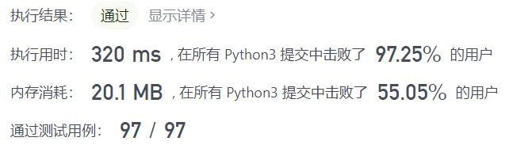
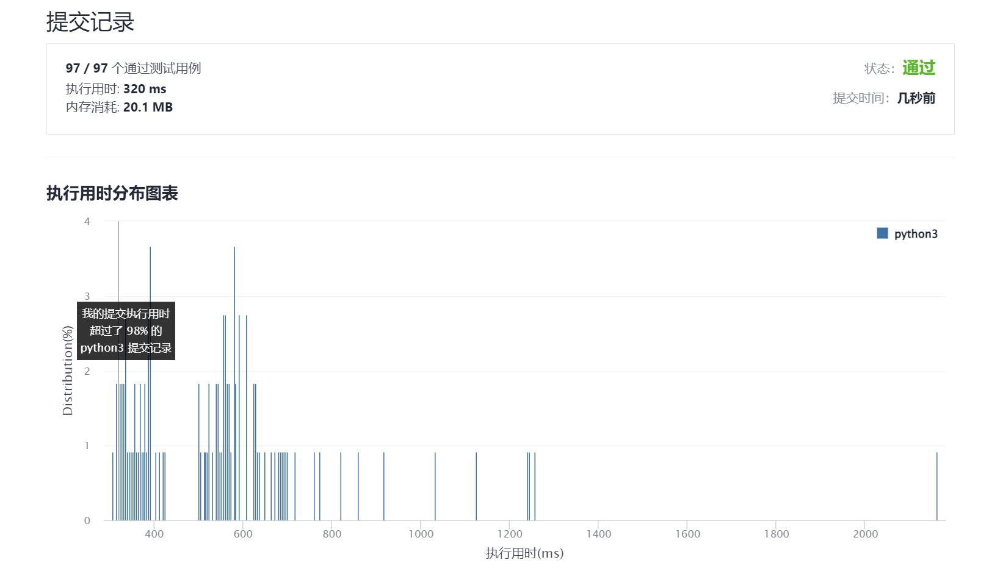

# 911-在线选举

Author：_Mumu

创建日期：2021/12/11

通过日期：2021/12/11

*****

踩过的坑：

1. 轻松愉快！
2. 啪得一下，很快啊，就解完了，还跟题解一模一样，舒服呀
3. 一开始还想用字典存结果，但是一想本来就要用二分查找了而且本来就有个时间列表了，那再搞个列表不就直接一一对应了嘛

已解决：173/2449

*****

难度：中等

问题描述：

给你两个整数数组 persons 和 times 。在选举中，第 i 张票是在时刻为 times[i] 时投给候选人 persons[i] 的。

对于发生在时刻 t 的每个查询，需要找出在 t 时刻在选举中领先的候选人的编号。

在 t 时刻投出的选票也将被计入我们的查询之中。在平局的情况下，最近获得投票的候选人将会获胜。

实现 TopVotedCandidate 类：

TopVotedCandidate(int[] persons, int[] times) 使用 persons 和 times 数组初始化对象。
int q(int t) 根据前面描述的规则，返回在时刻 t 在选举中领先的候选人的编号。

示例：

输入：
["TopVotedCandidate", "q", "q", "q", "q", "q", "q"]
[[[0, 1, 1, 0, 0, 1, 0], [0, 5, 10, 15, 20, 25, 30]], [3], [12], [25], [15], [24], [8]]
输出：
[null, 0, 1, 1, 0, 0, 1]

解释：
TopVotedCandidate topVotedCandidate = new TopVotedCandidate([0, 1, 1, 0, 0, 1, 0], [0, 5, 10, 15, 20, 25, 30]);
topVotedCandidate.q(3); // 返回 0 ，在时刻 3 ，票数分布为 [0] ，编号为 0 的候选人领先。
topVotedCandidate.q(12); // 返回 1 ，在时刻 12 ，票数分布为 [0,1,1] ，编号为 1 的候选人领先。
topVotedCandidate.q(25); // 返回 1 ，在时刻 25 ，票数分布为 [0,1,1,0,0,1] ，编号为 1 的候选人领先。（在平局的情况下，1 是最近获得投票的候选人）。
topVotedCandidate.q(15); // 返回 0
topVotedCandidate.q(24); // 返回 0
topVotedCandidate.q(8); // 返回 1

提示：

1 <= persons.length <= 5000
times.length == persons.length
0 <= persons[i] < persons.length
0 <= times[i] <= 109
times 是一个严格递增的有序数组
times[0] <= t <= 109
每个测试用例最多调用 104 次 q

来源：力扣（LeetCode）
链接：https://leetcode-cn.com/problems/online-election
