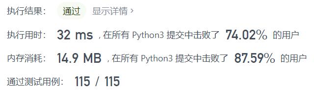
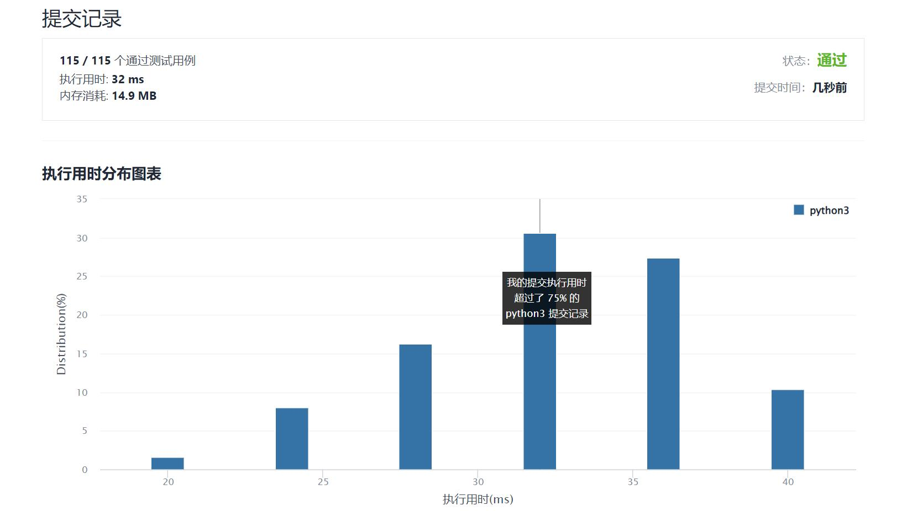

# 917-仅仅反转字母

Author：_Mumu

创建日期：2022/02/23

通过日期：2022/02/23

*****

踩过的坑：

1. 轻松愉快
2. 双指针，一个正向一个反向

已解决：259/2538

*****

难度：简单

问题描述：

给你一个字符串 s ，根据下述规则反转字符串：

所有非英文字母保留在原有位置。
所有英文字母（小写或大写）位置反转。
返回反转后的 s 。

 

示例 1：

输入：s = "ab-cd"
输出："dc-ba"
示例 2：

输入：s = "a-bC-dEf-ghIj"
输出："j-Ih-gfE-dCba"
示例 3：

输入：s = "Test1ng-Leet=code-Q!"
输出："Qedo1ct-eeLg=ntse-T!"

提示

1 <= s.length <= 100
s 仅由 ASCII 值在范围 [33, 122] 的字符组成
s 不含 '\"' 或 '\\'

来源：力扣（LeetCode）
链接：https://leetcode-cn.com/problems/reverse-only-letters
