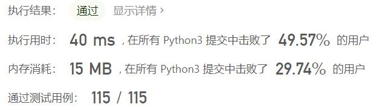

# 921-使括号有效的最少添加

Author：_Mumu

创建日期：2022/10/04

通过日期：2022/10/04

*****

踩过的坑：

1. 轻松愉快
1. 本质是找没有匹配的括号数
1. 可以用栈维护，碰到左括号直接入栈，碰到右括号，如果栈顶是左括号就将左括号出栈，否则右括号入栈
1. 由于只有左括号或右括号，可以只用两个变量分别计栈中的左括号数量和右括号数量来优化空间复杂度为$O(1)$

已解决：481/2801

*****

难度：中等

问题描述：

只有满足下面几点之一，括号字符串才是有效的：

它是一个空字符串，或者
它可以被写成 AB （A 与 B 连接）, 其中 A 和 B 都是有效字符串，或者
它可以被写作 (A)，其中 A 是有效字符串。
给定一个括号字符串 s ，移动N次，你就可以在字符串的任何位置插入一个括号。

例如，如果 s = "()))" ，你可以插入一个开始括号为 "(()))" 或结束括号为 "())))" 。
返回 为使结果字符串 s 有效而必须添加的最少括号数。

 

示例 1：

输入：s = "())"
输出：1
示例 2：

输入：s = "((("
输出：3

提示：

1 <= s.length <= 1000
s 只包含 '(' 和 ')' 字符。

来源：力扣（LeetCode）
链接：https://leetcode.cn/problems/minimum-add-to-make-parentheses-valid