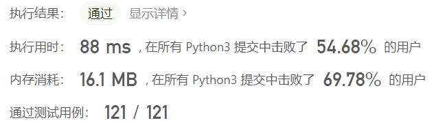
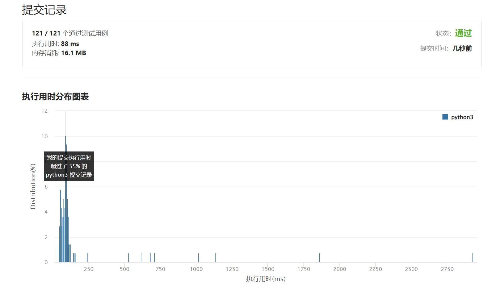

# 927-三等分

Author：_Mumu

创建日期：2022/10/06

通过日期：2022/10/06

*****

踩过的坑：

1. 轻松愉快（指直接cv

已解决：483/2802

*****

难度：困难

问题描述：

给定一个由 0 和 1 组成的数组 arr ，将数组分成  3 个非空的部分 ，使得所有这些部分表示相同的二进制值。

如果可以做到，请返回任何 [i, j]，其中 i+1 < j，这样一来：

arr[0], arr[1], ..., arr[i] 为第一部分；
arr[i + 1], arr[i + 2], ..., arr[j - 1] 为第二部分；
arr[j], arr[j + 1], ..., arr[arr.length - 1] 为第三部分。
这三个部分所表示的二进制值相等。
如果无法做到，就返回 [-1, -1]。

注意，在考虑每个部分所表示的二进制时，应当将其看作一个整体。例如，[1,1,0] 表示十进制中的 6，而不会是 3。此外，前导零也是被允许的，所以 [0,1,1] 和 [1,1] 表示相同的值。

 

示例 1：

输入：arr = [1,0,1,0,1]
输出：[0,3]
示例 2：

输入：arr = [1,1,0,1,1]
输出：[-1,-1]
示例 3:

输入：arr = [1,1,0,0,1]
输出：[0,2]

提示：

3 <= arr.length <= 3 * 104
arr[i] 是 0 或 1

来源：力扣（LeetCode）
链接：https://leetcode.cn/problems/three-equal-parts