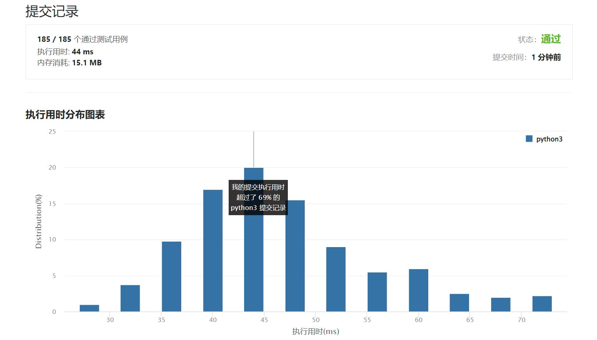

# 929-独特的电子邮件地址

Author：_Mumu

创建日期：2022/06/04

通过日期：2022/06/04

*****

踩过的坑：

1. 轻松愉快
1. 谢谢这题帮我复习了两个字符串方法的输出`str.split() -> list`以及`str.replace() -> str`

已解决：360/2658

*****

难度：简单

问题描述：

每个 有效电子邮件地址 都由一个 本地名 和一个 域名 组成，以 '@' 符号分隔。除小写字母之外，电子邮件地址还可以含有一个或多个 '.' 或 '+' 。

例如，在 alice@leetcode.com中， alice 是 本地名 ，而 leetcode.com 是 域名 。
如果在电子邮件地址的 本地名 部分中的某些字符之间添加句点（'.'），则发往那里的邮件将会转发到本地名中没有点的同一地址。请注意，此规则 不适用于域名 。

例如，"alice.z@leetcode.com” 和 “alicez@leetcode.com” 会转发到同一电子邮件地址。
如果在 本地名 中添加加号（'+'），则会忽略第一个加号后面的所有内容。这允许过滤某些电子邮件。同样，此规则 不适用于域名 。

例如 m.y+name@email.com 将转发到 my@email.com。
可以同时使用这两个规则。

给你一个字符串数组 emails，我们会向每个 emails[i] 发送一封电子邮件。返回实际收到邮件的不同地址数目。

 

示例 1：

输入：emails = ["test.email+alex@leetcode.com","test.e.mail+bob.cathy@leetcode.com","testemail+david@lee.tcode.com"]
输出：2
解释：实际收到邮件的是 "testemail@leetcode.com" 和 "testemail@lee.tcode.com"。
示例 2：

输入：emails = ["a@leetcode.com","b@leetcode.com","c@leetcode.com"]
输出：3

提示：

1 <= emails.length <= 100
1 <= emails[i].length <= 100
emails[i] 由小写英文字母、'+'、'.' 和 '@' 组成
每个 emails[i] 都包含有且仅有一个 '@' 字符
所有本地名和域名都不为空
本地名不会以 '+' 字符作为开头

来源：力扣（LeetCode）
链接：https://leetcode.cn/problems/unique-email-addresses