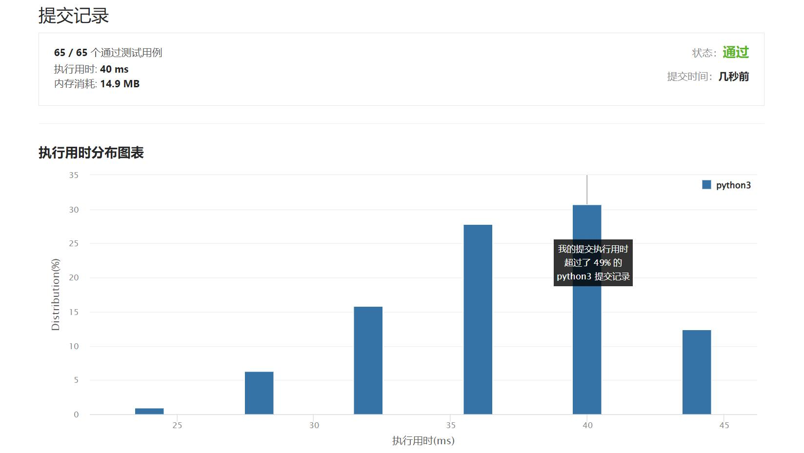

# 937-重新排列日志文件

Author：_Mumu

创建日期：2022/05/03

通过日期：2022/05/03

*****

踩过的坑：

1. 轻松愉快

已解决：328/2628

*****

难度：简单

问题描述：

给你一个日志数组 logs。每条日志都是以空格分隔的字串，其第一个字为字母与数字混合的 标识符 。

有两种不同类型的日志：

字母日志：除标识符之外，所有字均由小写字母组成
数字日志：除标识符之外，所有字均由数字组成
请按下述规则将日志重新排序：

所有 字母日志 都排在 数字日志 之前。
字母日志 在内容不同时，忽略标识符后，按内容字母顺序排序；在内容相同时，按标识符排序。
数字日志 应该保留原来的相对顺序。
返回日志的最终顺序。

 

示例 1：

输入：logs = ["dig1 8 1 5 1","let1 art can","dig2 3 6","let2 own kit dig","let3 art zero"]
输出：["let1 art can","let3 art zero","let2 own kit dig","dig1 8 1 5 1","dig2 3 6"]
解释：
字母日志的内容都不同，所以顺序为 "art can", "art zero", "own kit dig" 。
数字日志保留原来的相对顺序 "dig1 8 1 5 1", "dig2 3 6" 。
示例 2：

输入：logs = ["a1 9 2 3 1","g1 act car","zo4 4 7","ab1 off key dog","a8 act zoo"]
输出：["g1 act car","a8 act zoo","ab1 off key dog","a1 9 2 3 1","zo4 4 7"]

提示：

1 <= logs.length <= 100
3 <= logs[i].length <= 100
logs[i] 中，字与字之间都用 单个 空格分隔
题目数据保证 logs[i] 都有一个标识符，并且在标识符之后至少存在一个字

来源：力扣（LeetCode）
链接：https://leetcode-cn.com/problems/reorder-data-in-log-files