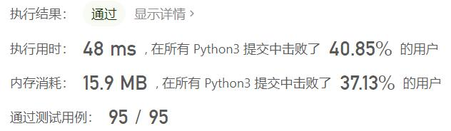
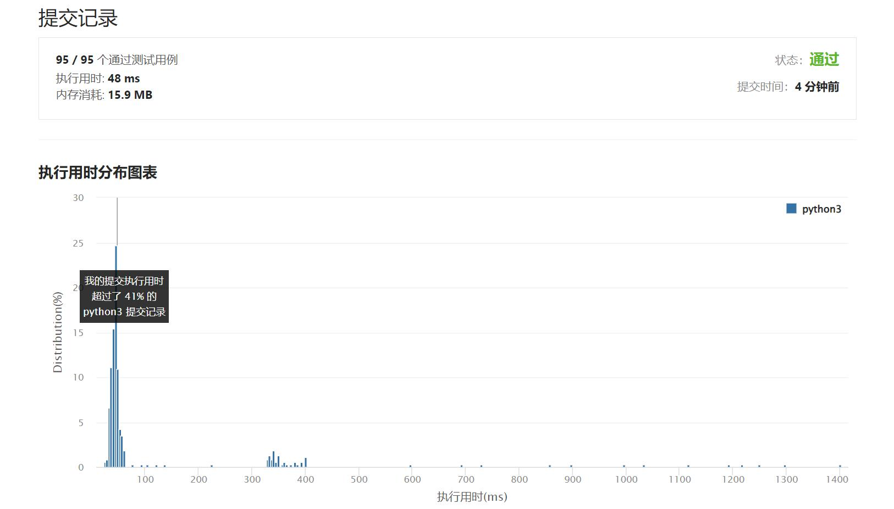

# 942-增减字符串匹配

Author：_Mumu

创建日期：2022/05/09

通过日期：2022/05/09

*****

踩过的坑：

1. 轻松愉快
1. 遇“I”取小遇“D”取大必符合条件，同时满足取大取小的数据结构就是队列了
1. 但属实没想到只要两个变量代表现存最大和最小的数就可以了，nb

已解决：334/2633

*****

难度：简单

问题描述：

由范围 [0,n] 内所有整数组成的 n + 1 个整数的排列序列可以表示为长度为 n 的字符串 s ，其中:

如果 perm[i] < perm[i + 1] ，那么 s[i] == 'I' 
如果 perm[i] > perm[i + 1] ，那么 s[i] == 'D' 
给定一个字符串 s ，重构排列 perm 并返回它。如果有多个有效排列perm，则返回其中 任何一个 。

 

示例 1：

输入：s = "IDID"
输出：[0,4,1,3,2]
示例 2：

输入：s = "III"
输出：[0,1,2,3]
示例 3：

输入：s = "DDI"
输出：[3,2,0,1]

提示：

1 <= s.length <= 105
s 只包含字符 "I" 或 "D"

来源：力扣（LeetCode）
链接：https://leetcode.cn/problems/di-string-match