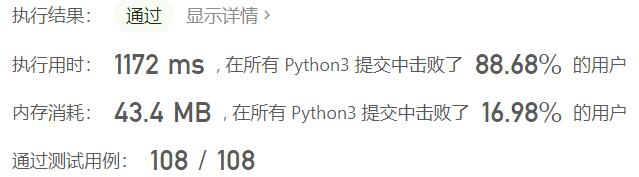
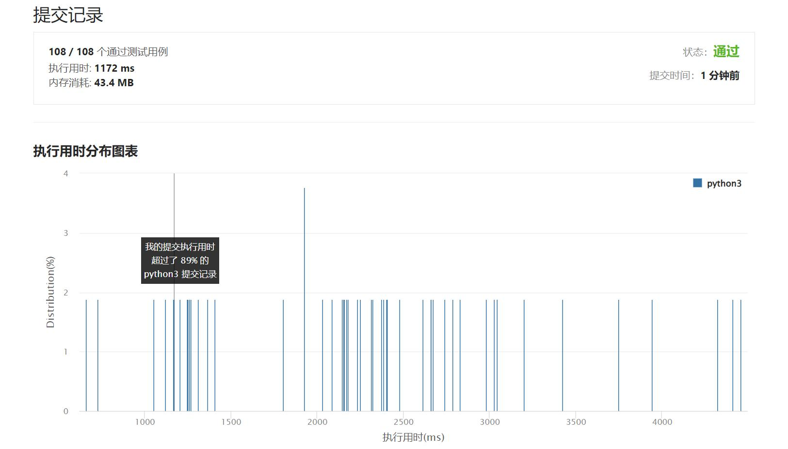

# 952-按公因数计算最大组件大小

Author：_Mumu

创建日期：2022/07/30

通过日期：2022/07/30

*****

踩过的坑：

1. 最大公约数构图，直接超时
1. 抄题解并查集，第一次也超时（我不理解
1. 复制题解，过了（我也不理解
1. 在题解的基础上建立质数表试图加速，超时（大概建质数表这个事太费时
1. 抄大佬代码，牛逼
1. 大佬代码较题解的优势在于，题解并查集巨大，大小为数组最大值；大佬并查集较小，大小为数组长度；并且大佬代码使用缓存加速质因数的计算

已解决：416/2722

*****

难度：困难

问题描述：

给定一个由不同正整数的组成的非空数组 nums ，考虑下面的图：

有 nums.length 个节点，按从 nums[0] 到 nums[nums.length - 1] 标记；
只有当 nums[i] 和 nums[j] 共用一个大于 1 的公因数时，nums[i] 和 nums[j]之间才有一条边。
返回 图中最大连通组件的大小 。

 

示例 1：

输入：nums = [4,6,15,35]
输出：4
示例 2：

输入：nums = [20,50,9,63]
输出：2
示例 3：

输入：nums = [2,3,6,7,4,12,21,39]
输出：8

提示：

1 <= nums.length <= 2 * 104
1 <= nums[i] <= 105
nums 中所有值都 不同

来源：力扣（LeetCode）
链接：https://leetcode.cn/problems/largest-component-size-by-common-factor