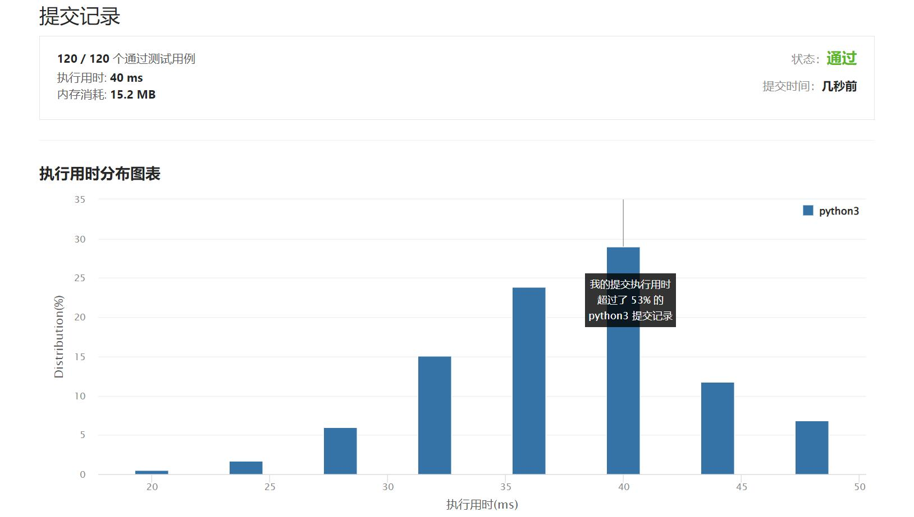

# 953-验证外星语词典

Author：_Mumu

创建日期：2022/05/17

通过日期：2022/05/17

*****

踩过的坑：

1. 轻松愉快

已解决：342/2642

*****

难度：简单

问题描述：

某种外星语也使用英文小写字母，但可能顺序 order 不同。字母表的顺序（order）是一些小写字母的排列。

给定一组用外星语书写的单词 words，以及其字母表的顺序 order，只有当给定的单词在这种外星语中按字典序排列时，返回 true；否则，返回 false。

 

示例 1：

输入：words = ["hello","leetcode"], order = "hlabcdefgijkmnopqrstuvwxyz"
输出：true
解释：在该语言的字母表中，'h' 位于 'l' 之前，所以单词序列是按字典序排列的。
示例 2：

输入：words = ["word","world","row"], order = "worldabcefghijkmnpqstuvxyz"
输出：false
解释：在该语言的字母表中，'d' 位于 'l' 之后，那么 words[0] > words[1]，因此单词序列不是按字典序排列的。
示例 3：

输入：words = ["apple","app"], order = "abcdefghijklmnopqrstuvwxyz"
输出：false
解释：当前三个字符 "app" 匹配时，第二个字符串相对短一些，然后根据词典编纂规则 "apple" > "app"，因为 'l' > '∅'，其中 '∅' 是空白字符，定义为比任何其他字符都小（更多信息）。

提示：

1 <= words.length <= 100
1 <= words[i].length <= 20
order.length == 26
在 words[i] 和 order 中的所有字符都是英文小写字母。

来源：力扣（LeetCode）
链接：https://leetcode.cn/problems/verifying-an-alien-dictionary