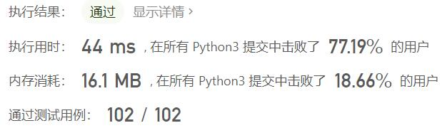
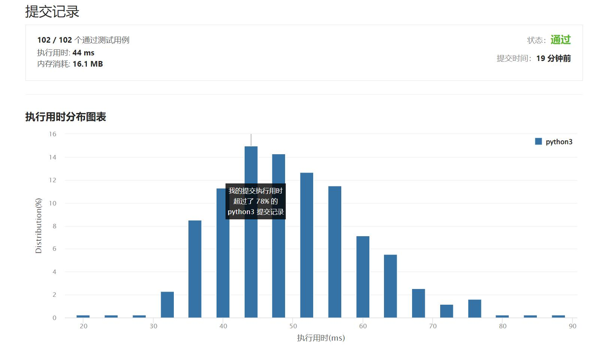

# 961-在长度2N的数组中找出重复N次的元素

Author：_Mumu

创建日期：2022/05/21

通过日期：2022/05/21

*****

踩过的坑：

1. 轻松愉快
1. 猴子算法的胜利

已解决：346/2643

*****

难度：简单

问题描述：

给你一个整数数组 nums ，该数组具有以下属性：

nums.length == 2 * n.
nums 包含 n + 1 个 不同的 元素
nums 中恰有一个元素重复 n 次
找出并返回重复了 n 次的那个元素。

 

示例 1：

输入：nums = [1,2,3,3]
输出：3
示例 2：

输入：nums = [2,1,2,5,3,2]
输出：2
示例 3：

输入：nums = [5,1,5,2,5,3,5,4]
输出：5

提示：

2 <= n <= 5000
nums.length == 2 * n
0 <= nums[i] <= 104
nums 由 n + 1 个 不同的 元素组成，且其中一个元素恰好重复 n 次

来源：力扣（LeetCode）
链接：https://leetcode.cn/problems/n-repeated-element-in-size-2n-array