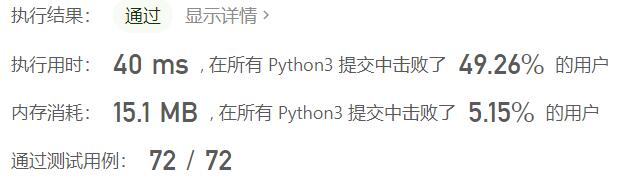
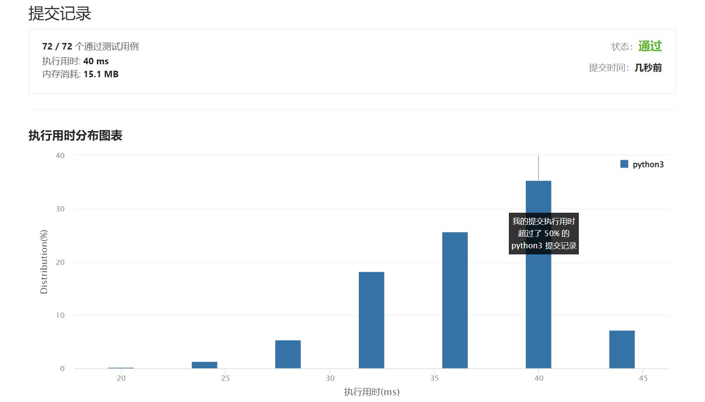

# 965-单值二叉树

Author：_Mumu

创建日期：2022/05/24

通过日期：2022/05/24

*****

踩过的坑：

1. 轻松愉快
1. 简单的dfs剪枝

已解决：349/2647

*****

难度：简单

问题描述：

如果二叉树每个节点都具有相同的值，那么该二叉树就是单值二叉树。

只有给定的树是单值二叉树时，才返回 true；否则返回 false。

 

示例 1：

输入：[1,1,1,1,1,null,1]
输出：true
示例 2：

输入：[2,2,2,5,2]
输出：false

提示：

给定树的节点数范围是 [1, 100]。
每个节点的值都是整数，范围为 [0, 99] 。

来源：力扣（LeetCode）
链接：https://leetcode.cn/problems/univalued-binary-tree