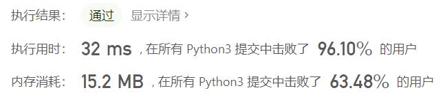
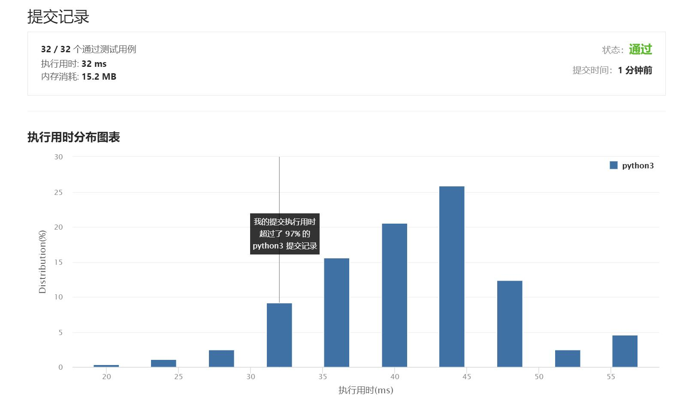

# 987-二叉树的垂序遍历

Author：_Mumu

创建日期：2021/7/31

通过日期：2021/7/31

*****

踩过的坑：

1. 我起了，一刀秒了，十分舒适
2. 我第一反应感觉好难，然后想着也算有个思路，就硬着头皮做吧
3. 思路是，递归遍历二叉树，建立哈希表，因为答案要求按列输出，所以哈希表键选择为列坐标，值为列表，包含该列上所有节点的行坐标与节点的值的元组
4. 由于输出时，同一列的元素要求按照行坐标排序，行坐标相同的再按节点的值排序，利用python对元组排序的特性（先按首位排序，再按剩余位依次排序）可以一键解决
5. 细节上：①构建哈希表的时候`defaultdict`比较好用，但输出为答案时`SortedDict`比较好用，我选择使用前者，在输出时对键再进行排序一下即可；②构建哈希表时，节点元组将`row`放在`val`之前，可以直接排序得到答案所需的排列

已解决：57/2175

*****

难度：中等

问题描述：

给你二叉树的根结点 root ，请你设计算法计算二叉树的 垂序遍历 序列。

对位于 (row, col) 的每个结点而言，其左右子结点分别位于 (row + 1, col - 1) 和 (row + 1, col + 1) 。树的根结点位于 (0, 0) 。

二叉树的 垂序遍历 从最左边的列开始直到最右边的列结束，按列索引每一列上的所有结点，形成一个按出现位置从上到下排序的有序列表。如果同行同列上有多个结点，则按结点的值从小到大进行排序。

返回二叉树的 垂序遍历 序列。

 

示例 1：

输入：root = [3,9,20,null,null,15,7]
输出：[[9],[3,15],[20],[7]]
解释：
列 -1 ：只有结点 9 在此列中。
列  0 ：只有结点 3 和 15 在此列中，按从上到下顺序。
列  1 ：只有结点 20 在此列中。
列  2 ：只有结点 7 在此列中。
示例 2：

输入：root = [1,2,3,4,5,6,7]
输出：[[4],[2],[1,5,6],[3],[7]]
解释：
列 -2 ：只有结点 4 在此列中。
列 -1 ：只有结点 2 在此列中。
列  0 ：结点 1 、5 和 6 都在此列中。
          1 在上面，所以它出现在前面。
          5 和 6 位置都是 (2, 0) ，所以按值从小到大排序，5 在 6 的前面。
列  1 ：只有结点 3 在此列中。
列  2 ：只有结点 7 在此列中。
示例 3：

输入：root = [1,2,3,4,6,5,7]
输出：[[4],[2],[1,5,6],[3],[7]]
解释：
这个示例实际上与示例 2 完全相同，只是结点 5 和 6 在树中的位置发生了交换。
因为 5 和 6 的位置仍然相同，所以答案保持不变，仍然按值从小到大排序。

提示：

树中结点数目总数在范围 [1, 1000] 内
0 <= Node.val <= 1000

来源：力扣（LeetCode）
链接：https://leetcode-cn.com/problems/vertical-order-traversal-of-a-binary-tree