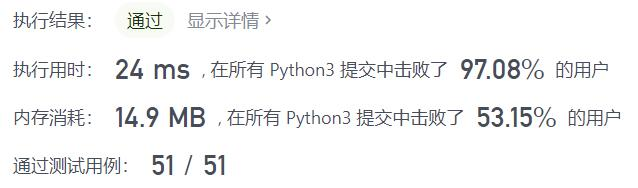
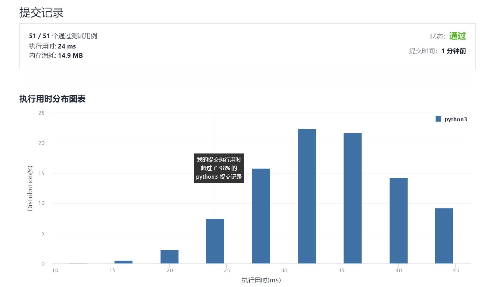

# 剑指Offer10-I-斐波那契数列

Author：_Mumu

创建日期：2021/9/4

通过日期：2021/9/4

*****

踩过的坑：

1. 简单简单！
2. 做过泰波拉契知道滚动数组之后，就十分轻松了
3. 写完之后本来想尝试一下能不能用公式偷鸡，结果发现数字太大的时候就会有误差了，可惜
4. 还是不太懂矩阵快速幂是怎么做到的

已解决：78/2333

*****

难度：简单

问题描述：

写一个函数，输入 n ，求斐波那契（Fibonacci）数列的第 n 项（即 F(N)）。斐波那契数列的定义如下：

F(0) = 0,   F(1) = 1
F(N) = F(N - 1) + F(N - 2), 其中 N > 1.
斐波那契数列由 0 和 1 开始，之后的斐波那契数就是由之前的两数相加而得出。

答案需要取模 1e9+7（1000000007），如计算初始结果为：1000000008，请返回 1。

 

示例 1：

输入：n = 2
输出：1
示例 2：

输入：n = 5
输出：5

提示：

0 <= n <= 100

来源：力扣（LeetCode）
链接：https://leetcode-cn.com/problems/fei-bo-na-qi-shu-lie-lcof
