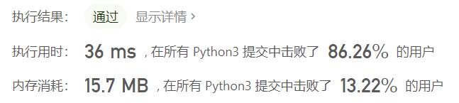

# 剑指Offer53-I-在排序数组中查找数字I

Author：_Mumu

创建日期：2021/7/16

通过日期：2021/7/16

*****

踩过的坑：

1. 第一反应直接按顺序数，然后觉得太没意思了就去看了题解
2. 题解是二分法，我咋就老想不到二分法呢
3. 先找左边界再找右边界，二者的判断条件有所不同
4. 写了一堆，还两次不通过，结果通了一看，最快的还是按顺序数一遍的...
5. 还看到一个代码只有一行：`return nums.count(target)`
6. 彳亍口巴

已解决：43/2159

*****

难度：简单

问题描述：

统计一个数字在排序数组中出现的次数。

 

示例 1:

输入: nums = [5,7,7,8,8,10], target = 8
输出: 2
示例 2:

输入: nums = [5,7,7,8,8,10], target = 6
输出: 0

来源：力扣（LeetCode）
链接：https://leetcode-cn.com/problems/zai-pai-xu-shu-zu-zhong-cha-zhao-shu-zi-lcof