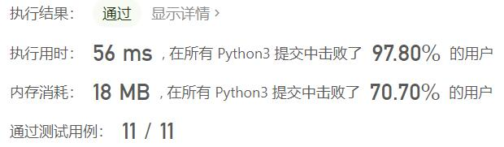
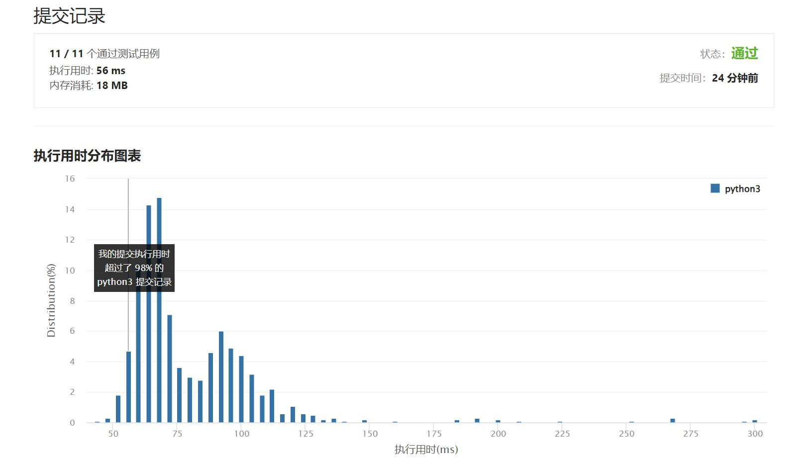

# 剑指OfferII041-滑动窗口的平均值

Author：_Mumu

创建日期：2022/07/16

通过日期：2022/07/16

*****

踩过的坑：

1. 轻松愉快

已解决：402/2706

*****

难度：简单

问题描述：

给定一个整数数据流和一个窗口大小，根据该滑动窗口的大小，计算滑动窗口里所有数字的平均值。

实现 MovingAverage 类：

MovingAverage(int size) 用窗口大小 size 初始化对象。
double next(int val) 成员函数 next 每次调用的时候都会往滑动窗口增加一个整数，请计算并返回数据流中最后 size 个值的移动平均值，即滑动窗口里所有数字的平均值。

示例：

输入：
inputs = ["MovingAverage", "next", "next", "next", "next"]
inputs = [[3], [1], [10], [3], [5]]
输出：
[null, 1.0, 5.5, 4.66667, 6.0]

解释：
MovingAverage movingAverage = new MovingAverage(3);
movingAverage.next(1); // 返回 1.0 = 1 / 1
movingAverage.next(10); // 返回 5.5 = (1 + 10) / 2
movingAverage.next(3); // 返回 4.66667 = (1 + 10 + 3) / 3
movingAverage.next(5); // 返回 6.0 = (10 + 3 + 5) / 3

提示：

1 <= size <= 1000
-105 <= val <= 105
最多调用 next 方法 104 次

来源：力扣（LeetCode）
链接：https://leetcode.cn/problems/qIsx9U