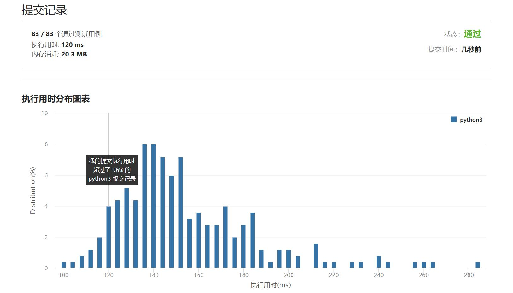

# 剑指OfferII115-重建序列

Author：_Mumu

创建日期：2022/07/23

通过日期：2022/07/23

*****

踩过的坑：

1. 轻松愉快
1. 只需要考虑相邻数的顺序关系即可

已解决：409/2712

*****

难度：中等

问题描述：

给定一个长度为 n 的整数数组 nums ，其中 nums 是范围为 [1，n] 的整数的排列。还提供了一个 2D 整数数组 sequences ，其中 sequences[i] 是 nums 的子序列。
检查 nums 是否是唯一的最短 超序列 。最短 超序列 是 长度最短 的序列，并且所有序列 sequences[i] 都是它的子序列。对于给定的数组 sequences ，可能存在多个有效的 超序列 。

例如，对于 sequences = [[1,2],[1,3]] ，有两个最短的 超序列 ，[1,2,3] 和 [1,3,2] 。
而对于 sequences = [[1,2],[1,3],[1,2,3]] ，唯一可能的最短 超序列 是 [1,2,3] 。[1,2,3,4] 是可能的超序列，但不是最短的。
如果 nums 是序列的唯一最短 超序列 ，则返回 true ，否则返回 false 。
子序列 是一个可以通过从另一个序列中删除一些元素或不删除任何元素，而不改变其余元素的顺序的序列。

 

示例 1：

输入：nums = [1,2,3], sequences = [[1,2],[1,3]]
输出：false
解释：有两种可能的超序列：[1,2,3]和[1,3,2]。
序列 [1,2] 是[1,2,3]和[1,3,2]的子序列。
序列 [1,3] 是[1,2,3]和[1,3,2]的子序列。
因为 nums 不是唯一最短的超序列，所以返回false。
示例 2：

输入：nums = [1,2,3], sequences = [[1,2]]
输出：false
解释：最短可能的超序列为 [1,2]。
序列 [1,2] 是它的子序列：[1,2]。
因为 nums 不是最短的超序列，所以返回false。
示例 3：

输入：nums = [1,2,3], sequences = [[1,2],[1,3],[2,3]]
输出：true
解释：最短可能的超序列为[1,2,3]。
序列 [1,2] 是它的一个子序列：[1,2,3]。
序列 [1,3] 是它的一个子序列：[1,2,3]。
序列 [2,3] 是它的一个子序列：[1,2,3]。
因为 nums 是唯一最短的超序列，所以返回true。

提示：

n == nums.length
1 <= n <= 104
nums 是 [1, n] 范围内所有整数的排列
1 <= sequences.length <= 104
1 <= sequences[i].length <= 104
1 <= sum(sequences[i].length) <= 105
1 <= sequences[i][j] <= n
sequences 的所有数组都是 唯一 的
sequences[i] 是 nums 的一个子序列

注意：本题与主站 444 题相同：https://leetcode-cn.com/problems/sequence-reconstruction/

来源：力扣（LeetCode）
链接：https://leetcode.cn/problems/ur2n8P