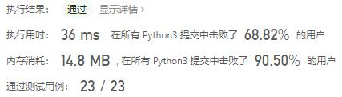
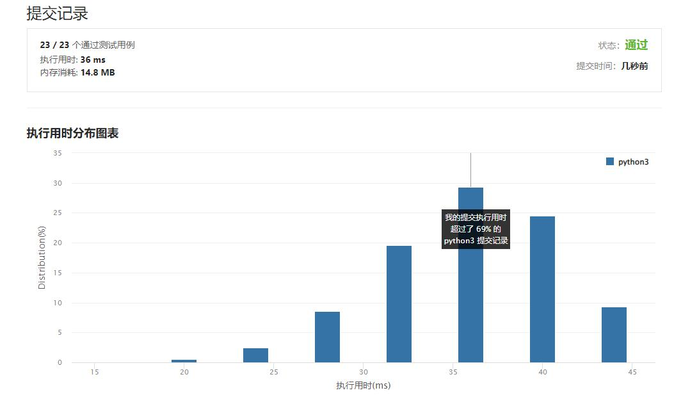

# 面试题01.02-判定是否互为字符重排

Author：_Mumu

创建日期：2022/09/30

通过日期：2022/09/30

*****

踩过的坑：

1. 轻松愉快

已解决：477/2793

*****

难度：简单

问题描述：

给定两个字符串 s1 和 s2，请编写一个程序，确定其中一个字符串的字符重新排列后，能否变成另一个字符串。

示例 1：

输入: s1 = "abc", s2 = "bca"
输出: true 
示例 2：

输入: s1 = "abc", s2 = "bad"
输出: false
说明：

0 <= len(s1) <= 100
0 <= len(s2) <= 100

来源：力扣（LeetCode）
链接：https://leetcode.cn/problems/check-permutation-lcci